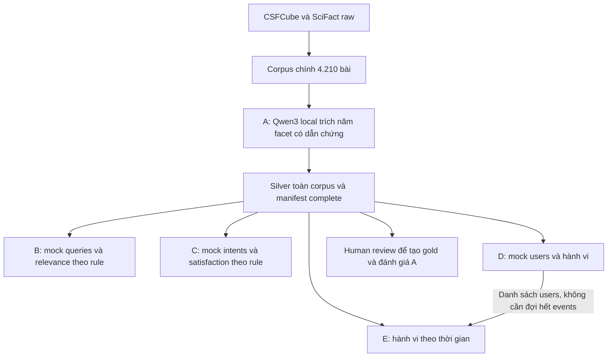

# Thực nghiệm khuyến nghị bài báo và hội nghị — DS300

Dùng corpus chính 4.210 bài. A đã có bộ chạy Qwen3 local `Qwen/Qwen3-4B-Instruct-2507` để trích
năm facet có dẫn chứng; 5 người chia nhau chạy 4.210 bài, mỗi người 842 bài,
chọn khoảng bằng `paper_range` trong config A. B–E
mock queries/intents/users/hành vi trên corpus thật và facet A. B/C/D làm
song song sau silver; E dùng chung users D. Chưa có gold hoặc kết quả mô hình.


**Cập nhật 2026-10-05:** đã có code gộp A, chọn 400 IDs chờ human review và sinh/kiểm tra
B–E theo số lượng mục tiêu. Snapshot đo mới nhất có A part_1 (842/4.210,
192 bài fallback/lỗi, 650 bài hợp lệ cho sampling);
dataset B–E trên corpus thật chờ parts 2–5. Xem [hướng dẫn chạy](docs/RUN_EXPERIMENTS.md).

## Mục lục

1. Trạng thái hiện tại và số liệu dữ liệu
2. Cấu trúc hệ thống và luồng xử lý
3. Các thực nghiệm và quan hệ phụ thuộc
4. Kế hoạch xây dataset và số lượng mục tiêu
5. Quy mô, pilot và điều kiện mở từng phần
6. Cấu trúc thư mục đầy đủ và vòng đời tệp
7. Contract, ID, provenance và định dạng dữ liệu
8. Năm facet dùng chung và silver/gold
9. Thực nghiệm A — Gán nhãn facet
10. Thực nghiệm B — Truy hồi theo facet
11. Thực nghiệm C — Ý định tường minh
12. Thực nghiệm D — Sở thích ngầm
13. Thực nghiệm E — Sở thích theo thời gian
14. Split và chống rò rỉ dữ liệu
15. Cách chạy các chức năng đã triển khai
16. Cấu hình, scope review và quy trình rebuild
17. Phạm vi IT, nhãn và trách nhiệm review
18. Kiểm tra, nghiệm thu và giới hạn hiện tại
19. Lộ trình dữ liệu và triển khai mô hình
20. Phần khuyến nghị hội nghị và các quyết định chưa chốt
21. Nguồn dữ liệu, Git và tài liệu tham chiếu

## 1. Trạng thái hiện tại và số liệu dữ liệu

| Hạng mục | Trạng thái thực tế |
|---|---|
| Dữ liệu gốc CSFCube | Đã tải bản v1.1, 4.207 bản ghi; giữ abstract, metadata, nhãn và cách chia gốc |
| Dữ liệu gốc SciFact | Đã tải 5.183 abstract; giữ claims, nhãn chứng cứ và cách chia gốc |
| Corpus IT chung | 4.210 bản ghi sau lọc phạm vi và gộp 25 bản ghi trùng |
| Đóng góp sau gộp | 4.182 bản ghi từ CSFCube và 28 bản ghi từ SciFact |
| Công cụ dữ liệu | Script tải, gộp corpus và kiểm tra chạy được |
| Kiểm tra | Corpus gate và kiểm tra offline đạt; xem docs/VALIDATION_STATUS.md |
| A local / mock B–E | A có code local/resume/validator, tool gộp và chọn review; B–E có generator/config/validator |
| Silver/gold năm facet | Silver part_1: 842/4.210; gold 400 bài chờ chọn từ full silver và người review |

Số 4.210 là số bản ghi canonical hiện tại, còn mang tính tạm thời: có 5 trường hợp
cùng tiêu đề nhưng khác abstract được giữ riêng để review. SciFact còn 15 bản ghi
giáp ranh bị tạm loại. Corpus vượt mục tiêu tối thiểu 3.000 về số lượng, nhưng còn
thiếu 1.790 so với mục tiêu làm việc 6.000. Không thêm bản trùng hoặc dữ liệu giả
để lấp chỉ tiêu. Số lượng đạt mục tiêu không tự bảo đảm chất lượng thực nghiệm.

## 2. Cấu trúc hệ thống và luồng xử lý

Hệ thống được mô tả theo bốn lớp. Đây là **cấu trúc logic**, không khẳng định tất
cả thành phần đã có code hoặc phải xây thành các service riêng.

| Lớp | Chức năng | Trạng thái |
|---|---|---|
| Nguồn và corpus | Tải, giữ bản gốc; lọc IT; chuẩn hóa, gộp trùng và cấp ID ổn định | Đã triển khai |
| Facet và dataset | Gán năm facet; xây query, ý định, hành vi và hồ sơ thời gian A–E | A có bộ chạy local; B–E có generator/validator, dataset trên corpus thật chờ A complete |
| Biểu diễn và khuyến nghị | Biểu diễn nội dung/facet, truy hồi ứng viên, suy ra sở thích và xếp hạng theo chế độ | Giai đoạn sau; chưa chọn model/embedding/dimension |
| Đánh giá và sử dụng | Đọc nhãn đúng giao thức, so sánh kết quả, phân tích lỗi; giao diện khi có nhu cầu | Giai đoạn sau; chưa có kết quả hoặc UI |



Facet A dựa trên bài thật; B–E sinh tình huống và hành vi mock, không mock facet.
Không cần chờ human gold hoặc embedding model để bắt đầu xây B–E.

### Luồng dữ liệu đang chạy được

1. `download_sources.py` tải hoặc kiểm tra archive/tài liệu đã có; giải nén có
   kiểm tra đường dẫn và lưu checksum từng tệp nguồn.
2. `build_corpus.py` đọc catalog của hai nguồn, áp dụng scope và override có
   reviewer; ghi quyết định của mọi bản ghi vào audit.
3. Chuẩn hóa nội dung, tìm alias/trùng, bảo toàn ID và nguồn đại diện đã cấp;
   ghi corpus, ID map, báo cáo và manifest.
4. `validate_all.py --phase corpus` kiểm tra nguồn, hashes, schema và liên kết
   trực tiếp trên corpus chính.

### Luồng khuyến nghị dự kiến khi có mô hình

| Chế độ | Thông tin người dùng đưa vào | Thành phần dữ liệu hỗ trợ | Kết quả mong muốn |
|---|---|---|---|
| Theo facet | Bài đang đọc + một facet muốn tìm tương tự | A và B | Danh sách bài liên quan theo facet đó |
| Theo ý định | Bài đang đọc + yêu cầu/ràng buộc rõ ràng | A và C | Bài thỏa toàn bộ yêu cầu đã chỉ định |
| Theo sở thích ngầm | Lịch sử tương tác được phép quan sát | A và D | Bài phù hợp với sở thích suy ra |
| Theo sở thích hiện tại | Lịch sử có thời gian và cutoff rõ ràng | A và E | Bài phù hợp với mối quan tâm mới nhất |

Dataset định nghĩa đầu vào và đáp án, không quyết định thay model. Khi triển khai
mô hình, cần chốt candidate protocol, observable features và chỉ số trước khi chạy.
Không cho mô hình đọc đáp án, latent truth hoặc tương tác tương lai để xếp hạng.

## 3. Các thực nghiệm và quan hệ phụ thuộc

| Thực nghiệm | Câu hỏi chính | Dữ liệu cần chuẩn bị |
|---|---|---|
| [A — Trích xuất facet](data/exp_a/README.md) | Có xác định đúng vấn đề, tác vụ, phương pháp, dataset và đóng góp của bài không? | Nhãn silver tự động và gold được người kiểm tra |
| [B — Truy hồi theo facet](data/exp_b/README.md) | Từ một bài mẫu, có tìm được bài phù hợp theo một khía cạnh cụ thể không? | Query, tập ứng viên và nhãn mức liên quan |
| [C — Ý định tường minh](data/exp_c/README.md) | Có đáp ứng yêu cầu kết hợp như cùng vấn đề nhưng khác phương pháp không? | Ý định, ràng buộc năm facet và nhãn thỏa/không thỏa |
| [D — Sở thích ngầm](data/exp_d/README.md) | Có suy ra sở thích từ lịch sử tương tác thay vì yêu cầu người dùng khai báo không? | Người dùng giả lập, lịch sử, tương tác tương lai và sở thích ẩn |
| [E — Sở thích theo thời gian](data/exp_e/README.md) | Có theo dõi được sở thích thay đổi qua nhiều giai đoạn không? | Cùng người dùng D, hồ sơ từng giai đoạn và luồng tương tác riêng |

Ví dụ xuyên suốt: người dùng đang đọc một bài về hệ thống khuyến nghị. A xác định
bài nghiên cứu vấn đề gì và dùng phương pháp nào; B tìm các bài tương tự theo
phương pháp; C tìm bài cùng vấn đề nhưng dùng phương pháp khác; D suy ra người dùng
thường quan tâm chủ đề nào từ lịch sử; E xét việc mối quan tâm đó thay đổi theo thời
gian. Đây là ví dụ giải thích mục tiêu, không phải kết quả mô hình đã chạy.

**Quan hệ dữ liệu hiện tại:** A trích facet trên corpus chính; B/C/D dùng
silver đó và không phụ thuộc output nhau. E cần danh sách users D và tạo
stream riêng, không cần chờ D hoàn thành tương tác. Gold A phục vụ đánh giá
chất lượng annotation, không phải prerequisite để phát triển B–E.

### Đọc bảng này để xây dataset: đầu vào/đầu ra của generator

**Nguyên liệu → generator → dataset → mô hình thực nghiệm.** Generator được dùng
nguồn nhãn hoặc latent truth để xây đáp án; mô hình về sau chỉ được đọc phần input
quan sát được. Ví dụ `retrieval_queries.jsonl`, `intents.jsonl`, `users.jsonl` và
`interactions_train.jsonl` đều do generator tương ứng tạo, không tự có sẵn từ corpus.

| Dataset | Nguyên liệu generator đọc | Generator tạo gì? | Phụ thuộc |
|---|---|---|---|
| A | Corpus + prompt/guideline + Qwen3 local | Silver, evidence metadata, manifest | Trọng số Qwen3 và môi trường GPU |
| B | Corpus + silver A + sampling/relevance rule | Mock queries/candidates/labels/splits | A silver, rule và generator B |
| C | Corpus + silver A + intent templates/rules | Mock intents/satisfaction/splits | A silver, templates và generator C |
| D | Corpus + silver A + simulator config | Mock users/latent profiles/history/holdout | A silver và simulator D |
| E | Users D + corpus + silver A + drift config | Temporal profiles và stream E riêng | A silver, users D và simulator E |

B–E dùng năm facet; native CSFCube ba facet chỉ là benchmark bổ sung tùy chọn.
Generator/validator B–E đã triển khai. Số annotation và output thực tế xem manifest; tests dùng fixture riêng.

Các mục “đầu vào/đầu ra” A–E bên dưới giờ là **của generator**, còn cách mô hình
đọc dataset được tách ở cuối mục kiểm tra. Folder `data` là nguyên liệu và output
dataset; việc model sinh ranking/scores là phase khác.

## 4. Kế hoạch xây dataset và số lượng mục tiêu

| Phần | Công việc chuẩn bị dataset | Số lượng mục tiêu |
|---|---|---|
| Corpus | Xây corpus IT chung; lọc phạm vi, gộp trùng, giữ ID/provenance; chốt schema và kiểm tra/tích hợp A–E | 6.000 bài, tối thiểu 3.000; hiện 4.210 bản ghi tạm thời |
| A | 5 người cùng chạy trích facet theo khoảng riêng; guideline/prompt, nhãn tự động và review | Silver trên 4.210 bài hiện có, 842 bài/người; 400 bài gold là mục tiêu review riêng |
| B | Xây dataset B: bài truy vấn, ứng viên và nhãn mức liên quan theo facet | 300 query × 100 candidates = khoảng 30.000 cặp |
| C | Xây dataset C: yêu cầu tìm bài, ràng buộc và nhãn ứng viên có thỏa yêu cầu không | 1.500 cases × 20 candidates; quota 6 types × 200 + 2 types × 150 |
| D/E | Xây dataset D: user giả lập, sở thích ẩn và hành vi; dataset E: cùng users qua nhiều giai đoạn | D: 300 users × 50 = 15.000 interactions. E: 300 users × 4 = 1.200 profiles, 15 events/user/period = 18.000 interactions |

Đây là mục tiêu làm việc, không phải dữ liệu đã hoàn thành. D và E không cộng
thành 600 users. Gold/silver là nhãn trên corpus, không phải corpus độc lập.
Số pair/case/event không bằng số bài độc lập và không được dùng để che lấp việc
corpus nhỏ hoặc nhãn thiếu chất lượng.

### Mốc bàn giao trước mắt

Corpus chính đã có; 5 người chia nhau chạy A silver, mỗi người 842 bài theo
[bảng khoảng trong README A](data/exp_a/README.md). Gom đủ năm phần và kiểm tra
coverage/dẫn chứng trước khi B/C/D dựng mock; D bàn giao users sớm cho E.
Không cần chờ human gold hoặc đủ 6.000 bài.

### Deliverables chung của từng thực nghiệm

- README giải thích format/rules, generator **chạy được**, bộ mẫu nhỏ và dataset
  đầy đủ khi các điều kiện đầu vào đã có.
- Manifest ghi contract/input/generator versions, seed, checksums và số bản ghi.
- Nhãn hoặc hidden truth tách đúng vai trò, có provenance; quy tắc split rõ ràng.
- Kiểm tra cấu trúc, ngữ nghĩa, tái lập và leakage; báo case skip, gap target và
  nhãn còn cần người review.

Thay đổi contract, vocabulary chung, ID map và split policy cần review trước
tích hợp. Mọi exp dùng cùng ID paper và corpus; chất lượng dataset cần kiểm tra,
không chỉ tạo đủ số dòng. Nhãn gold cần người kiểm tra, không được
thay bằng bộ sinh tự động để đủ 400 bài.

## 5. Quy mô, pilot và điều kiện mở từng phần

Chạy A silver trên toàn corpus trước; pilot B–E dùng ngay số lượng mục tiêu theo yêu cầu hiện tại.
Gold A là mục tiêu review riêng, không chặn generator B–E khi silver đã có.

| Phần | Mục tiêu làm việc | Điều kiện cần trước khi sinh dataset |
|---|---|---|
| Corpus | 6.000 bài; tối thiểu 3.000 | Review phạm vi IT, provenance, ID và trường hợp nghi trùng |
| A | 400 bài gold; silver trên 4.210 bài, chia 5 phần × 842 bài | Guideline, từ vựng và quy trình review được chốt |
| B | 300 query × 100 ứng viên | Nguồn nhãn và quy tắc facet/relevance được duyệt |
| C | 1.500 trường hợp, khoảng 5–10 loại ý định | Facet đầu vào và ràng buộc từng loại ý định được chốt |
| D | 300 người dùng × 50 tương tác | Quy tắc hồ sơ ẩn, tiếp xúc bài và nhiễu được công bố |
| E | Cùng 300 người dùng × 4 giai đoạn; khoảng 15.000–20.000 tương tác | Danh tính D, khoảng thời gian, tỷ lệ ổn định/thay đổi và cutoff được chốt |

Đây là mục tiêu workload từ tài liệu bàn giao, không phải số đã tạo và không phải
bảo đảm nguồn nhãn thật đủ số lượng. Riêng D/E là hành vi mô phỏng nếu không có
dữ liệu người dùng thật; phải ghi rõ giới hạn này trong mọi báo cáo.


### Pilot theo số lượng mục tiêu

Mỗi exp đọc corpus chính và silver A. Pilot chỉ giới hạn output query/case/user,
không dựng catalog mẫu hoặc facet giả.

| Phần | Mốc đầu tiên |
|---|---|
| A | `--limit 2` nếu cần kiểm tra local model; chạy tiếp toàn corpus và validate coverage |
| B | 300 query × 100 candidates; 60 query/facet |
| C | 1.500 cases × 20 candidates; quota tám loại intent |
| D | 300 users × 50 events; 30 history/20 future |
| E | Cùng 300 users D × 4 periods × 15 events; 150 stable/150 drift |

B–E vẫn ghi mock/synthetic dù dùng silver thật. Khi đổi input facet/rule, sinh
lại labels/splits/events và cập nhật hashes; thiếu ứng viên hợp lệ thì báo gap.

## 6. Cấu trúc thư mục đầy đủ và vòng đời tệp

```text
configs/                 Cấu hình seed, đường dẫn và quy tắc lọc IT
docs/                    Guideline, prompt, tài liệu phạm vi và báo cáo
schemas/                 Schema các bản ghi đang dùng
data/raw/csfcube/         Bản gốc CSFCube, nhãn, split và tài liệu nguồn
data/raw/scifact/         Bản gốc SciFact, claims, split và tài liệu nguồn
data/processed/          Corpus chung, ánh xạ ID, audit và manifest
data/exp_a/ ... exp_e/    Generator, README và dữ liệu riêng của A–E
scripts/exp_a/ ... exp_e/ Code chạy và đánh giá từng thực nghiệm
scripts/                 Tiện ích corpus, I/O và kiểm tra dùng chung
tests/                   Kiểm tra dữ liệu hợp lệ và các trường hợp lỗi
```

- `data/processed/papers.jsonl`: **corpus đầy đủ duy nhất**; dùng cho xử lý dữ liệu
  thật. Các thực nghiệm cùng tham chiếu `paper_id`, không lập corpus/ID riêng.
- `data/processed/id_map.jsonl`: ID nguồn → ID chung; giữ mọi nguồn gốc và nguồn
  đại diện của từng bài. ID đã cấp không đổi khi thêm nguồn hoặc đổi thứ tự.
- `data/processed/scope_audit.jsonl`: quyết định giữ/loại từng bản ghi và bằng chứng.
- `data/exp_a/generated/facets_silver.jsonl`: vị trí dự kiến nhãn tự động.
- `data/exp_a/generated/facets_gold.jsonl`: vị trí dự kiến nhãn đã được người review.
- `samples/generated/` và `samples/ground_truth/`: vị trí tùy chọn nếu cấu hình
  một bộ nhỏ. Mặc định pilot hiện dùng ngay quy mô mục tiêu ở `generated/`
  và `ground_truth/`; B–E vẫn ghi `dataset_kind: mock`.
- `generated/`: dữ liệu đầy đủ của exp; `ground_truth/`: nhãn/hồ sơ ẩn/tương lai
  chỉ dành cho đánh giá. Không đưa chúng vào đầu vào dự đoán hoặc xây hồ sơ.

Silver/gold chỉ chứa nhãn và tham chiếu ID, không chép lại abstract. Một bài có thể
có cả silver và gold để so sánh. Nội dung thật không làm nhãn giả trở thành gold.


### Cây thư mục và các tệp quan trọng

Các tệp đánh dấu `[dự kiến]` chưa được tạo; cây không phải khẳng định mọi dataset
đã tồn tại. Các thư mục output hiện có có thể chỉ chứa `.gitkeep`.

```text
paper-and-conference-recommendation-experiments/
├── README.md
├── DATA_CONTRACT.md
├── .gitignore
├── configs/
│   ├── data.json
│   ├── scope.json
│   ├── exp_b.json, exp_c.json, exp_d.json, exp_e.json
│   └── intent_templates.json
├── docs/
│   ├── DATA_FIRST_REFERENCE.md
│   ├── FACET_GUIDELINE.md
│   ├── ANNOTATION_PROMPT.md
│   ├── EXPERIMENT_README_TEMPLATE.md
│   ├── IT_SCOPE.md
│   ├── INGESTION_REPORT.md
│   ├── IMPLEMENTATION_PLAN.md
│   ├── VALIDATION_STATUS.md
│   ├── RUN_EXPERIMENTS.md
│   ├── EXPERIMENT_DATASETS_SPEC.md
│   └── EXPERIMENT_DATASETS_PLAN.md
├── schemas/
│   ├── paper.schema.json
│   ├── id_map.schema.json
│   └── scope_audit.schema.json
├── data/
│   ├── raw/
│   │   ├── README.md
│   │   ├── csfcube/       Archive, abstract/metadata, nhãn, split, giấy phép gốc
│   │   └── scifact/       Archive, corpus, claims, cross-validation, tài liệu gốc
│   ├── processed/
│   │   ├── README.md
│   │   ├── papers.jsonl
│   │   ├── id_map.jsonl
│   │   ├── scope_audit.jsonl
│   │   ├── corpus_report.json
│   │   ├── native_split_policy.json
│   │   └── manifest.json
│   ├── build_experiments.py, experiment_common.py
│   ├── exp_a/
│   │   ├── README.md
│   │   ├── build_exp_a.py
│   │   ├── merge_exp_a.py, select_gold_review.py
│   │   ├── config.json
│   │   ├── .env.example
│   │   ├── samples/       Pilot local dùng output chính; không mock facet
│   │   ├── generated/    part_1 hiện có; full silver/metadata chờ gộp đủ 5 parts
│   │   └── ground_truth/  gold_review: hàng đợi 400 bài, pending human review
│   ├── exp_b/
│   │   ├── README.md
│   │   ├── build_exp_b.py
│   │   ├── samples/
│   │   ├── generated/    retrieval_queries.jsonl [dự kiến]
│   │   └── ground_truth/  retrieval_labels.jsonl [dự kiến]
│   ├── exp_c/
│   │   ├── README.md
│   │   ├── build_exp_c.py
│   │   ├── samples/
│   │   ├── generated/    intents.jsonl [dự kiến]
│   │   └── ground_truth/  intent_labels.jsonl [dự kiến]
│   ├── exp_d/
│   │   ├── README.md
│   │   ├── build_exp_d.py
│   │   ├── samples/
│   │   ├── generated/    users, interactions_train [dự kiến]
│   │   └── ground_truth/  interactions_test, latent_user_profiles [dự kiến]
│   └── exp_e/
│       ├── README.md
│       ├── build_exp_e.py
│       ├── samples/
│       ├── generated/    interactions_train [dự kiến]; users đọc từ D
│       └── ground_truth/  interactions_test, temporal_profiles [dự kiến]
├── scripts/
│   ├── download_sources.py
│   ├── build_corpus.py
│   ├── validate_all.py
│   ├── experiment_io.py, validate_experiments.py
│   ├── exp_a/evaluate_exp_a.py
│   └── exp_b/ ... exp_e/  Vị trí code chạy mô hình, chưa triển khai
└── tests/
    ├── test_data_validation.py, test_exp_a.py, test_exp_a_resume.py
    ├── test_exp_a_handoff.py
    └── test_experiment_datasets.py, test_experiment_pipeline.py, test_qwen_evaluation.py
```

`raw` là bản gốc bất biến; `processed` là corpus chuẩn hóa có thể rebuild bằng
code và dùng trực tiếp cho tất cả exp. Mặc định output B–E nằm ở `generated/`
và `ground_truth/` theo quy mô mục tiêu; `samples/` là vị trí tùy chọn qua config.
Mock hay real do manifest xác định, không suy từ tên folder. Input và truth tách riêng.
Việc tách thư mục phải đi kèm loader allowlist, không chỉ dựa vào tên folder.
Generator từng exp nằm trong `data/exp_*`; điều phối và rule sinh dữ liệu dùng chung
ở `data/build_experiments.py`, `data/experiment_common.py`. Code chạy/đánh giá
thực nghiệm nằm trong `scripts/exp_*`; xem [quy ước scripts](scripts/README.md).
Schema/rule A–E được kiểm tra trực tiếp trong Python validators. README từng exp
mô tả code/config/output hiện có; các tệp dataset đánh dấu dự kiến vẫn chờ đầu vào đầy đủ.

## 7. Contract, ID, provenance và định dạng dữ liệu

[DATA_CONTRACT.md](DATA_CONTRACT.md) là nguồn quy ước chuẩn; các mô tả bên dưới
tóm tắt contract 1.0. Thay đổi ý nghĩa field/schema phải có phiên bản và Khải review.

| Hạng mục | Quy ước |
|---|---|
| Encoding | UTF-8; JSONL một object/dòng; JSON cho cấu hình và manifest |
| Paper ID | `P` + 6 chữ số, ví dụ `P000054` |
| User/query/intent ID | `U`/`Q`/`I` + 4 chữ số |
| Seed | 42 mặc định; đầu vào được sort trước sampling |
| Facet missing | `[]`, không null hoặc string đơn |
| Timestamp | ISO-8601 có timezone, ưu tiên UTC |
| Trọng số sở thích ẩn | Số hữu hạn trong [-1,1] |
| Version/provenance | Contract, input, generator, seed và actual counts trong manifest |

### Paper record

Corpus có `paper_id`, `source`, `source_id`, `title`, `abstract`, `year`, `domain`,
`scope_evidence`. `source_id` luôn là string; year là integer hợp lệ hoặc null.
Abstract chuẩn hóa chỉ nối các câu và thu gọn whitespace; bản raw vẫn giữ nguyên.
Domain IT có bằng chứng từ phạm vi nguồn hoặc quyết định filter/review, chưa phải
nhãn subject được người kiểm tra độc lập cho toàn corpus. Không nhét relevance,
intent labels hoặc latent preferences vào record bài.

### ID map và gộp trùng

Khóa nguồn `(source,source_id)` liên kết tới canonical `paper_id`. Một bài có thể
có nhiều alias, nhưng đúng một alias active được đánh dấu `primary` làm nguồn
đại diện. Nguồn đại diện không tự đổi khi thêm alias. `content_sha256` kiểm tra
record nguồn chuẩn hóa; `active=false` giữ ID lịch sử đã cấp khi bài bị loại.

Ưu tiên identifier chung; sau đó chỉ gộp title chuẩn hóa giống nhau khi abstract
cũng tương đương theo rule hiện có. Cùng title khác abstract giữ riêng để review.
Không gộp vì chủ đề giống; không xóa ID map để cấp lại ID khi rebuild. Xung đột
identifier hoặc thay đổi nguồn làm đổi nghĩa ID phải dừng và xử lý có phiên bản.

### Manifest và dữ liệu thật/mô phỏng

Manifest ghi dataset_kind, contract version, seed, generator version/hash,
input checksum và số records thật sự đã tạo. Không đưa thời điểm build vào phần
so sánh deterministic. Corpus luôn là real; manifest exp ghi mock cho lớp
nhãn/query/hành vi kiểm thử, đồng thời lưu path/hash corpus chính đã dùng.
Mọi paper_id đều resolve trong cùng corpus; không cấp ID cho catalog mock riêng.
Dataset dùng bài thật nhưng intent/user behavior sinh bằng code vẫn phải công bố
nguồn nhãn/hành vi synthetic, không đồng nhất mọi field với dữ liệu thu thập thật.

## 8. Năm facet dùng chung và silver/gold

| Khóa trong dữ liệu | Ý nghĩa | Cần phân biệt |
|---|---|---|
| `problem` | Vấn đề hoặc hạn chế nghiên cứu muốn giải quyết | Không đồng nhất với thao tác của hệ thống |
| `task` | Tác vụ cần thực hiện, như truy hồi hoặc phân loại | Không phải tên thuật toán |
| `method` | Thuật toán hoặc kỹ thuật thực sự được sử dụng | Không tự động là đóng góp mới |
| `dataset` | Tên bộ dữ liệu/tài nguyên được dùng và có bằng chứng | Không suy từ lĩnh vực hay tên hội nghị |
| `contribution` | Đóng góp mới được bài khẳng định và có căn cứ | Không sao chép chung chung từ phương pháp |

Mỗi facet là danh sách chuỗi; không có bằng chứng thì dùng `[]`. Tuy nhiên,
**chưa annotation** khác với **đã annotation nhưng không tìm thấy giá trị**.
Hiện chưa tạo `facets.jsonl` để tránh biến danh sách rỗng thành nhãn giả.
Facet gốc `background/method/result` của CSFCube là một hệ khác, chưa có quy tắc
chuyển sang năm facet trên được duyệt. Nhãn SUPPORT/CONTRADICT của SciFact là nhãn
kiểm chứng phát biểu, không phải nhãn khuyến nghị bài báo.


**Silver** là annotation tự động có nguồn/model/prompt/version rõ ràng.
**Gold** là annotation đã qua human review theo guideline, không phải tên khác
của silver. Có thể cùng một bài có cả hai tier để đánh giá A. Gold thật cần
quy trình xử lý bất đồng và tập held-out; không dùng held-out để chỉnh prompt.
Review scope IT, native relevance hay nhãn câu của nguồn không thay thế gold
năm facet. B–E dùng silver A; review để tạo gold tiến hành riêng, không cần
chờ gold để xây các generator mock.

## 9. Thực nghiệm A — Trích năm facet bằng Qwen3 local

Cả nhóm 5 người cùng chạy trích facet trên 4.210 title/abstract, chia thành
5 phần không trùng nhau, mỗi người 842 bài. Chạy Qwen3 trên máy, không dùng
API key. Corpus thật và schema năm facet vẫn dùng chung B–E.

### 9.1. Mục đích

Trích problem, task, method, dataset, contribution từ title/abstract thật.
Output tự động là silver, cần review chất lượng; không tự tạo human gold.
Không thay năm facet bằng ba nhãn câu gốc CSFCube hoặc facet mock.

### 9.2. Đầu vào

| Input | Đường dẫn/giá trị |
|---|---|
| Corpus | `data/processed/papers.jsonl`, toàn bộ 4.210 bài |
| Config | `data/exp_a/config.json` |
| Khoảng bài | `paper_range: [bài_đầu, bài_cuối]`, mặc định `[1, 842]` |
| Thư mục kết quả | `output_dir`, mặc định `data/exp_a/generated/part_1` |
| Model | `Qwen/Qwen3-4B-Instruct-2507`, revision cố định trong config |
| Thiết bị | `cuda`; đã kiểm tra máy có RTX 4060 Laptop 8 GB |
| Prompt/guideline | `docs/ANNOTATION_PROMPT.md`, `docs/FACET_GUIDELINE.md` |
| Trọng số/cache | `models/huggingface/`, Git bỏ qua |

Trọng số tải từ Hugging Face lần đầu. Suy luận chạy trên máy; title/abstract
không gửi tới dịch vụ annotation. Bản Instruct này không có thinking. Dùng NF4 4-bit (bitsandbytes), tính toán float16 trên GPU.

#### Chia 4.210 bài cho 5 người

Số thứ tự bắt đầu từ **1**, sau khi sắp corpus tăng dần theo `paper_id`;
**lấy cả bài đầu và bài cuối**. Giữ nguyên corpus, không cắt thành năm tệp.

| Phần chạy | `paper_range` | Paper IDs | Số bài | `output_dir` |
|---|---|---|---|---|
| Phần 1 | `[1, 842]` | `P000001`–`P000842` | 842 | `data/exp_a/generated/part_1` | Khải
| Phần 2 | `[843, 1684]` | `P000843`–`P001684` | 842 | `data/exp_a/generated/part_2` | Quỳnh
| Phần 3 | `[1685, 2526]` | `P001685`–`P002526` | 842 | `data/exp_a/generated/part_3` | Kiên
| Phần 4 | `[2527, 3368]` | `P002527`–`P003368` | 842 | `data/exp_a/generated/part_4` | Phi
| Phần 5 | `[3369, 4210]` | `P003369`–`P004210` | 842 | `data/exp_a/generated/part_5` | Phú

Mỗi người chọn một phần và sửa **hai giá trị** `paper_range`, `output_dir`
trong config trên máy mình. Ví dụ phần 2 (chỉ trích hai trường cần sửa):

```json
{
  "paper_range": [843, 1684],
  "output_dir": "data/exp_a/generated/part_2"
}
```

Giữ các trường config còn lại. `[1, null]` chọn toàn corpus; `[3369, null]`
chọn từ bài 3.369 tới cuối. Bỏ `paper_range` cũng chọn toàn corpus để tương thích
config cũ. Khoảng đảo ngược, ngoài corpus hoặc không phải số nguyên sẽ báo lỗi
trước khi nạp model. Khi corpus thay đổi phải chia lại khoảng theo số bài thực tế.

### 9.3. Đầu ra

Tệp của từng phần nằm trong `output_dir` tương ứng, ví dụ
`data/exp_a/generated/part_1/`:

| Tệp | Vai trò |
|---|---|
| `facets_silver.jsonl` | ID và đúng năm list concept string |
| `annotation_metadata.jsonl` | Câu dẫn chứng nguyên văn, model/revision/runtime, token count, seed/attempt |
| `manifest.json` | Hashes, coverage, missing IDs, partial/complete |
| `.exp_a_checkpoint.sqlite3` | Lưu từng bài hợp lệ để tiếp tục; không commit Git |
| `last_failure.json` nếu fallback | Paper ID, output được chọn, điểm và lỗi của từng lượt để rà lại |

Manifest giữ `corpus_count: 4210` và coverage của **toàn corpus**; một phần đủ
842 bài vẫn có `status: partial`, các ID ngoài khoảng vẫn nằm trong `missing_ids`.
Kiểm tra từng phần bằng `--validate-only --allow-partial`; đối chiếu các ID còn
thiếu **trong khoảng được giao** để biết phần đó đã xong chưa. Khi gom năm phần,
ghép cả silver và metadata theo `paper_id`, kiểm tra không trùng/thiếu và tạo
manifest cho bộ đầy đủ ở `data/exp_a/generated/` trước khi bàn giao B–E.
Không dùng manifest của một phần làm manifest toàn corpus.

Lượt gọi API cũ chưa tạo annotation nào; checkpoint/output lỗi được giữ tại
`generated/api_attempt_backup/`. Qwen không trộn provenance API vào silver mới. Pilot v1.3 bị loại do nhãn
chép định nghĩa; giữ để audit ở `generated/pilot_rejected_v13/`. Các pilot trước khi chỉnh prompt/feedback nằm trong `pilot_rejected_v14/` và `pilot_before_feedback/`; không trộn vào silver hiện tại.

### 9.4. Quy tắc nhãn

Qwen chọn concept và evidence_id từ các câu đánh số T0/A0/A1... của bài.
Code lấy nguyên văn câu đã chọn và xác định source title/abstract, không yêu cầu
model chép lại câu dài. Metadata giữ cả sentence selections. Concept phải bám vào từ trong câu đã chọn
(so khớp sau chuẩn hóa case/dấu câu và biến thể động từ có quy tắc như representing/represent,
extracting/extract, running/run). Cho phép rút gọn bằng cách bỏ từ,
nhưng phải giữ thứ tự từ và ít nhất **70% số từ trong đoạn nguồn ngắn nhất chứa concept**;
không so độ dài concept với toàn bộ câu. Cụm ngắn được chép nguyên văn luôn đạt ngưỡng.
Không thêm từ mới hoặc dùng từ đồng nghĩa không có trong câu dẫn chứng.
Ngoặc ví dụ được ghi rõ bằng `e.g.`, `for example`, `for instance` hoặc `such as`
có thể bỏ qua khi tính tỷ lệ giữ từ. Ngoặc chứa viết tắt, định nghĩa, điều kiện hoặc phủ định
vẫn được tính; câu dẫn chứng trong metadata luôn giữ nguyên văn. Nếu concept trích từ chính
ngoặc ví dụ, vẫn kiểm tra với toàn bộ câu gốc để không làm mất dẫn chứng hợp lệ.
Code kiểm tra
đúng ID/khóa/list, không trùng concept và câu dẫn chứng có trong bài. Không có
bằng chứng dùng `[]`; chưa xử lý không được chèn nhãn rỗng giả. Metadata ghi
`annotator_type: qwen_local`, `tier: silver`, `review_status: unreviewed`.

JSON được yêu cầu bằng prompt và kiểm tra sau sinh; không có bảo đảm schema từ
dịch vụ API. Mỗi lượt được chấm điểm và thu thập **tất cả lỗi concept** để model sửa
cùng lúc. Khi có kết quả đạt kiểm tra và đã rà các facet trống theo quy tắc dưới,
lưu ngay. **Hết lượt vẫn lỗi thì lưu kết quả có điểm cao nhất**, giữ cả concept
chưa đạt kiểm tra, thay vì bỏ cả paper. Ngưỡng 70% là tiêu chí retry, không phải điều
kiện loại paper ở lượt cuối. Metadata ghi `fallback_used: true`, `validation_errors`,
`selected_score`, `attempt` được chọn, `attempts_used` và `attempt_scores` của mọi lượt
(gồm raw output, seed, điểm, lỗi và usage). Tổng usage tính cả các lượt retry.
`manifest.fallback_annotations` liệt kê các paper còn lỗi; `missing_ids` chỉ chứa
paper chưa có bản ghi. Chạy lại tiếp tục các ID còn thiếu, không sinh lại fallback đã lưu.
Lỗi môi trường/GPU vẫn dừng tiến trình.

Điểm từ **0–100** là thước đo bám nguồn theo quy tắc, không phải xác suất đúng ngữ nghĩa:

| Thành phần | Điểm tối đa |
|---|---:|
| Số facet có ít nhất một concept đạt kiểm tra / 5 | 60 |
| Số concept đạt kiểm tra / tổng số item model sinh | 25 |
| Tỷ lệ giữ từ trung bình của các concept | 5 |
| JSON đúng ID, đủ khóa, đúng list/item/evidence_id | 10 |

Concept trùng không tăng điểm và được gộp trong output; bản raw vẫn giữ nguyên.
Hòa điểm ưu tiên JSON đọc được, rồi ít lỗi hơn, rồi lượt sớm hơn. Concept có evidence_id
không tồn tại vẫn được giữ trong fallback nhưng ghi `source: unresolved`, `evidence: ""`;
không gán dẫn chứng khác cho nó. Nếu mọi lượt đều không đọc được JSON, vẫn xuất đúng
paper_id và năm list rỗng, có lỗi và raw output để rà lại. Bản ghi này biểu thị model
không tạo được nhãn, không khẳng định paper không có facet.
`max_attempts: 3` là **tổng ba lần sinh**, bao gồm lần đầu, retry và lượt rà lại.
Nếu kết quả hợp lệ có **ít nhất 3/5 facet trống**, model phải rà lại title T0 và
từng câu abstract một lần. Sau lượt rà lại, facet thiếu bằng chứng vẫn được giữ `[]`;
không ép model điền nhãn. Nếu chỉ tới lần sinh cuối mới nhận được kết quả cần rà lại,
dùng fallback có điểm cao nhất và ghi lỗi thiếu lượt rà lại. Rút gọn quá 30% hoặc chọn
sai evidence_id cũng retry trong ngân sách này.
Quy tắc này thuộc extraction policy 2.3, được thêm sau prompt 1.5 và thay thế yêu cầu
chép cụm liên tục của prompt gốc. Metadata ghi `extraction_policy_version`,
`sparse_reviewed` và ngưỡng kiểm tra trong `request_parameters`.
Câu trích có thật vẫn có thể không hỗ trợ concept: cần người review ngữ nghĩa.

### 9.5. Cách chạy

Môi trường riêng `.venv-qwen` dùng Python 3.11, PyTorch CUDA và Transformers.
Nếu đã có môi trường này, lệnh quen thuộc tự chuyển sang đúng Python. Từ folder
`data/exp_a`:

```powershell
python build_exp_a.py --dry-run
python build_exp_a.py --limit 2
python build_exp_a.py
python build_exp_a.py --validate-only --allow-partial
```

Không cần `.env`. `--dry-run` hiển thị khoảng, IDs, số bài được chọn và thư mục
kết quả để kiểm tra trước khi chạy. Mặc định chỉ xử lý bài còn thiếu **trong
`paper_range`**; `--limit` là số bài mới tối đa trong khoảng đó, không thay đổi
ranh giới phần chạy. Config hiện chọn phần 1; đổi khoảng/thư mục trước khi chạy
phần khác. Chạy lại cùng config sẽ tiếp tục checkpoint của phần đó.

Khi bắt đầu, code hiển thị số bài đã lưu, còn thiếu và cần rà lại **trong khoảng
được chọn**. Dò theo `paper_id` nên bài thiếu ở giữa vẫn được xử lý; bài đã lưu
không tính vào `--limit`. Nếu mất checkpoint, code phục hồi từ
`annotation_metadata.jsonl` và `manifest.json` đã kiểm tra hash/provenance,
đối chiếu với `facets_silver.jsonl` nếu tệp này còn. Nếu chỉ thiếu tệp silver,
dẫn chứng trong metadata đủ để tạo lại mà không nạp model. Khi checkpoint còn,
các tệp JSONL/manifest bị thiếu được xuất lại từ checkpoint. Mất cả checkpoint
và metadata hoặc manifest thì cần khôi phục bản sao trước khi chạy tiếp.

Nếu thiết lập lại máy, từ thư mục gốc dự án dùng Python 3.11:

```powershell
python -m venv .venv-qwen
.\.venv-qwen\Scripts\python.exe -X utf8 -m pip install torch==2.6.0 --index-url https://download.pytorch.org/whl/cu124
.\.venv-qwen\Scripts\python.exe -X utf8 -m pip install -r data/exp_a/requirements.txt
```

### 9.6. Tiến độ và tái lập

Model được nạp một lần mỗi tiến trình, xử lý tuần tự và lưu từng bài sau khi đạt
kiểm tra hoặc chọn fallback tốt nhất. Năm người chạy trên máy riêng với cùng corpus/model/prompt; mỗi phần
có output/checkpoint riêng. OS lock chặn hai lượt chạy cùng output. Dừng rồi chạy lại cùng lệnh
tiếp tục bài thiếu. Checkpoint chưa có annotation nào được khởi tạo lại khi đổi cấu hình.
Nếu đã có annotation, đổi khoảng bài, model/revision/prompt/thiết bị/tham số
sampling hoặc code generator thì dùng output mới;
max_new_tokens/max_attempts có thể tăng để tiếp tục checkpoint.
Riêng bản bổ sung phục hồi JSONL giữ nguyên policy 2.3 và chấp nhận fingerprint
của generator 2.3 trước đó; không cần đổi `output_dir` cho nâng cấp này.
Riêng bản generator 2.0, 2.1 và 2.2 có fingerprint đã biết được nâng lên policy 2.3 tự động
khi corpus, config, prompt và guideline không đổi. Các bài cũ có ít nhất 3 facet
trống chưa được rà lại được xử lý lại; bài đã có `sparse_reviewed: true` được giữ nguyên.
Chỉ thay kết quả cũ khi kết quả mới hợp lệ; nếu lượt rà lại chỉ có fallback, giữ kết quả
đã nhận. Các ID bị REJECTED ở bản cũ còn thiếu sẽ được sinh lại bằng cơ chế chấm điểm mới.
Việc rà lại bài đã có trong checkpoint không tính vào số bài mới của `--limit`.
Nhấn Ctrl+C để dừng có lưu kết quả, rồi chạy lại cùng lệnh để dùng code mới.
Seed/phiên bản được ghi để truy nguồn, không bảo đảm kết quả giống hệt trên GPU khác.

### 9.7. Nghiệm thu

Chạy tests, corpus gate và validator từng phần. Chỉ bộ đã gom đủ 4.210 IDs,
metadata tương ứng và manifest toàn corpus hợp lệ với `status: complete` mới
được bàn giao cho B–E. B/C/D sinh dataset mock song
song trên facet A; E còn cần users D. Không cần chờ gold; đánh giá chất lượng
A vẫn cần human-reviewed gold riêng, không tự chấm bằng chính silver. Prompt v1.5 dùng P000001 làm ví dụ phát triển prompt; bài này không được đưa vào held-out gold.

Các tệp JSONL/manifest được xuất khi lượt chạy kết thúc hoặc dừng có xử lý;
tiến độ bền vững nằm trong checkpoint riêng của mỗi phần. Output/checkpoint
của lượt toàn corpus cũ ở `generated/` không phải output của năm phần mới.
Không chạy hai tiến trình cùng `output_dir`. Kiểm tra dẫn chứng không bảo đảm
chọn đúng facet hoặc trích đủ ý; các nhãn vẫn là silver chưa review.

Nguồn: [model card Qwen3-4B-Instruct-2507](https://huggingface.co/Qwen/Qwen3-4B-Instruct-2507),
[PyTorch CUDA 12.4](https://pytorch.org/get-started/previous-versions/#v260).

### 9.8. Gộp năm phần và chọn 400 bài review

Từ gốc dự án, sau khi nhận đủ parts 1–5:

~~~powershell
python data/exp_a/merge_exp_a.py --dry-run
python data/exp_a/merge_exp_a.py
python data/exp_a/select_gold_review.py --dry-run
python data/exp_a/select_gold_review.py
~~~

Tool gộp kiểm tra coverage từng khoảng/toàn corpus, không trùng ID, input/config
provenance và model/revision thực tế được ghi trong metadata. Chỉ khi đủ 4.210 bài
mới ghi silver, metadata và manifest complete ở `data/exp_a/generated/`.

Tool review chọn mặc định 400 IDs, không random: số facet có dữ liệu giảm dần,
rồi số concept có dẫn chứng giảm dần, rồi paper_id tăng dần. Bỏ P000001,
fallback/validation errors và bài không có facet trích được. Nếu thiếu 400 bài
hợp lệ thì báo thiếu. Không ghi đè queue review đã có.

Gold là đáp án người kiểm tra dùng để đánh giá **độ đúng và độ đầy đủ** của facet A,
độc lập với Qwen silver. Output selector chỉ là form pending và danh sách bài,
không tự tạo `facets_gold.jsonl`. Nhãn silver nằm trong tệp tham chiếu riêng để
đối chiếu sau review. Cách chọn này ưu tiên silver đầy đủ, không đại diện ngẫu nhiên
cho toàn corpus. Xem [hướng dẫn chạy](docs/RUN_EXPERIMENTS.md) để biết tệp,
preview part_1 và quy trình review.

## 10. Thực nghiệm B — Truy hồi bài báo theo một facet

**Quy mô mặc định:** 300 queries × 100 candidates = 30.000 cặp; 60 query/facet.
Đã có generator `data/exp_b/build_exp_b.py`, config và validator.
Dataset trên corpus thật chờ gộp A complete; tests dùng fixtures riêng.

Concept sets bằng nhau → 2, giao nhau → 1, không giao → 0; thiếu facet đích thì loại.
Mỗi query có positive/negative và không self/duplicate; chia theo anchor 70/15/15.
Query/splits ở generated, labels/provenance ở ground_truth.

Mô hình đọc input quan sát được để xếp hạng; evaluator đọc truth riêng.
Chi tiết đầu vào, schema, rules và lệnh chạy:
[README B](data/exp_b/README.md), [hướng dẫn chung](docs/RUN_EXPERIMENTS.md).

## 11. Thực nghiệm C — Khuyến nghị theo ý định tường minh

**Quy mô mặc định:** 1.500 cases × 20 candidates = 30.000 cặp; quota 6 types × 200 + 2 types × 150.
Đã có generator `data/exp_c/build_exp_c.py`, config và validator.
Dataset trên corpus thật chờ gộp A complete; tests dùng fixtures riêng.

Ràng buộc similar/different/ignore đủ năm facet, nối bằng AND; thiếu facet hoạt động thì loại.
Có positive/negative, hard negative vi phạm đúng một constraint; chia theo nhóm anchor.
Intents/splits ở generated, satisfaction labels/provenance ở ground_truth.

Mô hình đọc input quan sát được để xếp hạng; evaluator đọc truth riêng.
Chi tiết đầu vào, schema, rules và lệnh chạy:
[README C](data/exp_c/README.md), [hướng dẫn chung](docs/RUN_EXPERIMENTS.md).

## 12. Thực nghiệm D — Suy ra sở thích ngầm từ hành vi người dùng

**Quy mô mặc định:** 300 users × 50 events = 15.000; mỗi người 30 history/20 future.
Đã có generator `data/exp_d/build_exp_d.py`, config và validator.
Dataset trên corpus thật chờ gộp A complete; tests dùng fixtures riêng.

Profile sinh trước events từ concepts A, weights thích/tránh, exposure mixture và nhiễu có version.
Users chỉ có ID; history ở generated, latent profiles và future ở ground_truth.
Timestamps UTC tăng nghiêm ngặt; behavior report chỉ thống kê history.

Mô hình đọc input quan sát được để xếp hạng; evaluator đọc truth riêng.
Chi tiết đầu vào, schema, rules và lệnh chạy:
[README D](data/exp_d/README.md), [hướng dẫn chung](docs/RUN_EXPERIMENTS.md).

## 13. Thực nghiệm E — Theo dõi sở thích thay đổi theo thời gian

**Quy mô mặc định:** Cùng 300 users D × 4 periods × 15 events = 18.000; 1.200 profiles.
Đã có generator `data/exp_e/build_exp_e.py`, config và validator.
Dataset trên corpus thật chờ gộp A complete; tests dùng fixtures riêng.

150 stable/150 drift; hệ số [0,0.5,1,1], bốn periods tháng 1–4/2026 (UTC).
Periods 1–3 history, period 4 holdout; E không đọc D future hoặc latent profiles.
Groups/temporal profiles/future ở ground_truth; behavior report chỉ đếm history.

Mô hình đọc input quan sát được để xếp hạng; evaluator đọc truth riêng.
Chi tiết đầu vào, schema, rules và lệnh chạy:
[README E](data/exp_e/README.md), [hướng dẫn chung](docs/RUN_EXPERIMENTS.md).

## 14. Split và chống rò rỉ dữ liệu

Split xác định dữ liệu được dùng để xây/chỉnh phương pháp và dữ liệu giữ lại để
đánh giá cuối. Nhãn là đáp án kiểm tra; observable input là phần mô hình được biết.

| Phần | Quy tắc cần tuân thủ |
|---|---|
| Corpus | Giữ split nguồn; chưa tự gán split chung từ query/claim splits |
| A | Gold held-out không dùng chỉnh prompt/guideline dựa trên đáp án test |
| B/C | Split custom nhóm theo bài query; candidate catalog được chia sẻ khi protocol cho phép |
| D | Mỗi user có past history và future holdout, đề xuất 30/20 events |
| E | Đề xuất periods 1–3 history, 4 holdout; cutoff độc lập D |

Các ràng buộc bắt buộc: latest train event trước earliest test event theo user;
timestamp bằng nhau phải ở cùng phía; không đọc relevance/satisfaction/latent
weights/future events để xây input hoặc profile. Không coi unjudged là negative,
không coi unobserved là dislike. Label provenance và source-native protocol phải
được giữ để giải thích phép đánh giá. Nếu muốn đánh giá unseen-paper, cần protocol
riêng; không tự áp ràng buộc candidate corpus disjoint lên mọi bài toán.

## 15. Cách chạy các chức năng đã triển khai

Python 3.11 trở lên và thư viện chuẩn là đủ. Mở terminal tại thư mục dự án và chạy
lần lượt:

```powershell
python scripts/download_sources.py
python scripts/build_corpus.py
python scripts/validate_all.py --dataset-kind real --phase corpus
python tests/test_data_validation.py
```

Lệnh tải cần internet; dữ liệu đã có được tái sử dụng và kiểm tra checksum, không
tự tải đè bản mới. Các bước còn lại chạy offline. `seed 42` giúp lấy mẫu tái lập
khi đầu vào và code không đổi; số 42 là quy ước, không phải yêu cầu thuật toán.
Validator corpus dùng dữ liệu chính; validators A và B–E được chạy ở các gate riêng.

Từ folder data/exp_a, dùng `python build_exp_a.py`; nếu có .venv-qwen, bộ chạy
tự dùng Python của môi trường đó. Chọn `paper_range` và `output_dir` riêng cho
từng phần trong config A; mặc định phần 1 là `[1, 842]`. Không cần API key.
Dùng `--dry-run` để kiểm tra khoảng, `--limit 2` để kiểm tra model và
`--validate-only --allow-partial` để kiểm tra output của từng phần.

Sau khi nhận đủ năm phần, chạy từ gốc dự án:

~~~powershell
python data/exp_a/merge_exp_a.py --dry-run
python data/exp_a/merge_exp_a.py
python data/exp_a/select_gold_review.py
python data/exp_b/build_exp_b.py
python data/exp_c/build_exp_c.py
python data/exp_d/build_exp_d.py
python data/exp_e/build_exp_e.py
python scripts/validate_all.py --dataset-kind mock --phase experiments
~~~

Gate real/corpus kiểm tra corpus; real/experiments kiểm tra A complete;
mock/experiments kiểm tra B–E, có `--experiment b/c/d/e` để chọn riêng.
Các runner có `--dry-run`, `--validate-only` và `--config`.
B–E yêu cầu A complete; không suy từ corpus pass rằng mọi exp đã hoàn thành.
Chi tiết và lựa chọn partial/shortfall: [RUN_EXPERIMENTS](docs/RUN_EXPERIMENTS.md).

## 16. Cấu hình, scope review và quy trình rebuild

`configs/data.json` hiện khai báo contract 1.0, seed 42,
`data/processed/papers.jsonl`, `data/processed/id_map.jsonl`, đường dẫn scope policy
và dataset_kind real. Đây là cấu hình dữ liệu, không có tham số embedding/model.

`configs/scope.json` chứa version, nguồn CS có bằng chứng, terms/method markers và
overrides. Bộ lọc phrase là heuristic: có thể bỏ sót synonym hoặc nhầm background
với đóng góp IT. Audit phải được review trước freeze, không xem rule là đáp án gold.

### Thay đổi phạm vi bài

1. Tìm ID trong audit, đọc title/abstract/metadata gốc, phân biệt IT contribution
   hoặc phương pháp tính toán rõ ràng với từ khóa tình cờ.
2. Thêm override `source:source_id` gồm include boolean, reviewer string và reason
   string không rỗng. Rule thay đổi ý nghĩa thì cập nhật policy version.
3. Chạy corpus builder trên ID map hiện có, rồi
   validator/tests. Không sửa corpus thủ công hoặc xóa nguồn đại diện đã cấp.
4. Đọc report mới: số được giữ/loại, thiếu metadata, duplicates, title conflicts,
   gap target; review trước khi chốt release.

### Đổi nguồn hoặc dữ liệu đầu vào

Không thay archive dưới tên phiên bản cũ. Downloader tái sử dụng/kiểm tra hash
và từ chối raw đã đổi. Khi nguồn phát hành bản mới, giữ version cũ, xác định
release/version mới và review ảnh hưởng ID/nhãn/split trước cập nhật pipeline.
Không tự bổ sung nguồn ngoài để đủ 6.000 nếu chưa xác nhận phạm vi và provenance.
Không chạy đồng thời hai builder ghi cùng bộ output.

## 17. Phạm vi IT, nhãn và trách nhiệm review

CSFCube được nhận theo phạm vi lấy mẫu computer science đã mô tả trong tài liệu
nguồn. SciFact chỉ được nhận khi có bằng chứng rõ về kỹ thuật tính toán/phần mềm.
Ứng dụng AI/IT trong y sinh có thể phù hợp; bài sinh học thông thường có từ
“model”, “network” hoặc “imaging” chưa đủ điều kiện. Bộ lọc từ khóa có thể bỏ sót
hoặc nhận nhầm, nên quyết định hiện tại còn chờ review.

Xem [quy tắc phạm vi IT](docs/IT_SCOPE.md), [contract dữ liệu](DATA_CONTRACT.md),
[báo cáo ingestion](docs/INGESTION_REPORT.md) và [trạng thái kiểm tra](docs/VALIDATION_STATUS.md).
Mỗi quyết định ghi đè bộ lọc phải có người review và lý do; review phạm vi bởi
Codex không được tính là gold facet do con người gán nhãn.

Giữ nhãn và split gốc để không mất đáp án/quy trình đánh giá. Split query/claim
của nguồn không phải cách chia train/dev/test chung cho tất cả bài trong corpus.
Chưa chia lại corpus ở bước ingestion. Khi xây B/C, chia theo nhóm bài truy vấn để
tránh cùng anchor xuất hiện ở nhiều tập. D/E chia theo thời gian từng người dùng;
không để nhãn hay dữ liệu tương lai lọt vào đầu vào mô hình.

Contract, corpus và quy ước chung cần review trước tích hợp. Mỗi thực nghiệm
cần generator, manifest, nhãn và kiểm tra chất lượng trước khi gọi là hoàn tất.

## 18. Kiểm tra, nghiệm thu và giới hạn hiện tại

### Gate đang có

Validator corpus kiểm tra nguồn/raw và output checksums; ID duy nhất, source refs
và primary aliases; text/schema/year/domain/evidence; coverage audit; manifest
counts và nội dung corpus so với nguồn. Bộ test corpus có 10 kiểm tra về scope, gộp trùng,
provenance/ID/primary ổn định, metadata sai, validator dùng trực tiếp corpus, path traversal,
reviewer/reason và các corruption của refs/facet/time.

A có validator riêng; B–E có schema/rule/quota/hash/split/temporal và leakage gates.
Gate experiments yêu cầu output/input phù hợp đã tồn tại. Tham khảo
[trạng thái kiểm tra](docs/VALIDATION_STATUS.md); trạng thái pass trước đây phải
được chạy lại khi code, input hoặc scope thay đổi.

### Nghiệm thu mock trước

A silver toàn corpus qua validator. Generator B–E tạo query/case/user/hành vi
mock trên corpus/facets A; manifest ghi rule/seed/hashes; refs, positive/negative,
hidden truth và split/leakage đạt. Code đã kiểm tra trên fixtures; bộ từ corpus thật
chờ A complete. Không yêu cầu human gold để sinh B–E.

### Điều kiện nghiệm thu dataset trên dữ liệu thật của mỗi exp

- Generator chạy thật trên đúng corpus/facets, seed và input version.
- README/schema/mẫu/manifest thống nhất; IDs và counts resolve đúng.
- Labels/truth tách khỏi observable inputs; positive/negative/split hợp lệ.
- Kiểm tra ngữ nghĩa và leakage, bao gồm các case bị làm sai có chủ đích.
- Tái tạo cùng seed/input cho cùng output; ghi nguồn nhãn và giới hạn synthetic.
- Gold và native/custom label mapping được review; số lượng thiếu được báo thật.

### Khi nào được gọi là data-first release hoàn tất?

Corpus đã review phạm vi/dedup/provenance; ID và protocol split được chốt; A–E
có dataset/generator/nhãn/rules phù hợp và tất cả gate tương ứng đạt. Gold thật
đã review; không có mock refs trong real; loader dùng đúng paths. Đối chiếu kế hoạch
DS300 gốc khi truy cập được và ghi khác biệt trước freeze. Hiện mới hoàn thành
ingestion và các generator/validators A–E; bộ dữ liệu thật và human gold
chưa đạt data-first release đầy đủ.

## 19. Lộ trình dữ liệu và triển khai mô hình

1. Chạy A bằng Qwen3 local trên toàn corpus, kiểm tra dẫn chứng/coverage và bàn giao silver.
2. B/C/D xây dataset mock song song; D bàn giao danh sách users để E xây stream riêng.
3. Pilot theo số lượng mục tiêu, kiểm tra refs/schema/rules/split/leakage và gap.
4. Review chất lượng silver và corpus/scope/xung đột tiêu đề; tạo human gold độc lập.
5. Chốt protocol/metrics, triển khai và đánh giá mô hình. Mock kiểm tra giả thuyết
   mô phỏng, không phải bằng chứng hành vi người thật.

Khuyến nghị hội nghị chưa có catalog/nhãn độc lập. Native CSFCube là benchmark
tùy chọn, không thay B năm facet. Tài liệu bàn giao cũ ở docs/DATA_FIRST_REFERENCE.md;
yêu cầu hiện tại thay kế hoạch mock facet bằng trích facet A bằng Qwen3 local trước.

## 20. Phần khuyến nghị hội nghị và các quyết định chưa chốt

A–E hiện định nghĩa thí nghiệm **khuyến nghị bài báo**. Venue trong metadata nguồn
chỉ là dữ liệu xuất bản, có thể thiếu hoặc không đồng nhất; chưa đủ để biến thành
đáp án hội nghị phù hợp cho một bài mới. Chưa có dataset hội nghị hoặc thực nghiệm
hội nghị độc lập, nên không tự thêm một Exp F vào kế hoạch.

Nếu mở phần hội nghị, cần xác nhận mục tiêu (tìm venue phù hợp chủ đề hay hỗ trợ
chọn nơi nộp bài), nguồn catalog/định danh, phạm vi IT, metadata theo thời gian và
nguồn relevance ground truth; sau đó mới chốt schema/split/generator/đánh giá.
Không đoán venue phù hợp từ title hoặc lịch sử xuất bản rồi gọi là human gold.

Các rules mock B–E, templates, exposure/noise, drift/boundaries và splits hiện
đã công bố trong configs/READMEs. Trước đánh giá thực cần review tính phù hợp,
vocabulary/alias/guideline A, protocol/metrics/cutoff và kế hoạch DS300 gốc. Model,
embedding dimension, cosine/dot product, temporal decay và UI thuộc phase sau.

## 21. Nguồn dữ liệu, Git và tài liệu tham chiếu

- [CSFCube v1.1](https://github.com/iesl/CSFCube/releases/tag/v1.1): giữ giấy phép
  CC BY-NC 4.0 và thông tin trích dẫn đi kèm.
- [SciFact](https://github.com/allenai/scifact): giữ nguyên LICENSE.md và điều kiện
  sử dụng cho corpus/claims được nguồn công bố.

README gốc của hai nguồn trong `data/raw/` giữ nguyên để bảo toàn provenance.
`source_manifest.json` ghi URL và checksum SHA-256.

**Quy ước Git hiện tại:** các thực nghiệm A–E chỉ commit/push code, cấu hình
và tài liệu. Mọi thư mục `generated/` và `ground_truth/` trong `data/exp_*/`,
kể cả đầu ra trong `samples/`, được `.gitignore` bỏ qua và giữ trên máy.
Dữ liệu raw và processed vẫn được phép commit/push. `.gitignore` cũng loại cache,
Python environment, secrets (`.env`), checkpoint cục bộ A, tệp tạm và embeddings/models.
Quy tắc tách hidden truth khỏi đầu vào mô hình và kiểm tra leakage vẫn bắt buộc.

Repository đã có commit bootstrap; README không dùng trạng thái commit/push
tĩnh làm bằng chứng remote. Kiểm tra trạng thái Git thực tế trước mỗi lần stage,
commit hoặc push. Không force-push, không ghi đè lịch sử/file người khác. Giữ giấy
phép và attribution đi kèm nguồn khi chia sẻ dữ liệu.

Branches trong tài liệu bàn giao là quy ước **dự kiến**, không phải các branch đã tạo:

```text
main
data/core-corpus
data/exp-a-facets
data/exp-b-retrieval
data/exp-c-intent
data/exp-de-user
```

Mỗi thực nghiệm cần README, code, sample/dataset và manifest;
review schema/integration. Thay đổi shared contract/config/ID map/split policy cần
review trước tích hợp. Không thay nguồn corpus hoặc chuẩn ID riêng ở từng branch.

## Tài liệu liên quan

- [Đo thời gian generator A–E và ước lượng full](docs/GENERATOR_TIMING.md):
  đo Qwen thật, benchmark đủ quota và chẩn đoán thiếu mẫu B/C trên part_1.
- [Đánh giá Qwen silver bằng 400 bài human gold](docs/EVALUATE_QWEN.md): code
  `scripts/exp_a/evaluate_exp_a.py`, per-facet Precision/Recall/F1 và đối chiếu từng bài.
- [Contract dữ liệu chuẩn](DATA_CONTRACT.md)
- [Tài liệu bàn giao data-first](docs/DATA_FIRST_REFERENCE.md)
- [Phạm vi IT và review audit](docs/IT_SCOPE.md)
- [Guideline gán facet](docs/FACET_GUIDELINE.md)
- [Prompt annotation Qwen](docs/ANNOTATION_PROMPT.md)
- [Mẫu README thực nghiệm](docs/EXPERIMENT_README_TEMPLATE.md)
- [Báo cáo corpus hiện tại](docs/INGESTION_REPORT.md)
- [Kiểm tra đã thực hiện](docs/VALIDATION_STATUS.md)

README tổng mô tả hệ thống và trạng thái triển khai; contract quyết định schema
chuẩn. Khi thay đổi dữ liệu/giao thức, cập nhật contract, README tổng và README
exp liên quan cùng nhau để tránh khác biệt giữa các tài liệu.

- [Hướng dẫn gộp A, chọn 400 bài review và chạy B–E](docs/RUN_EXPERIMENTS.md)
