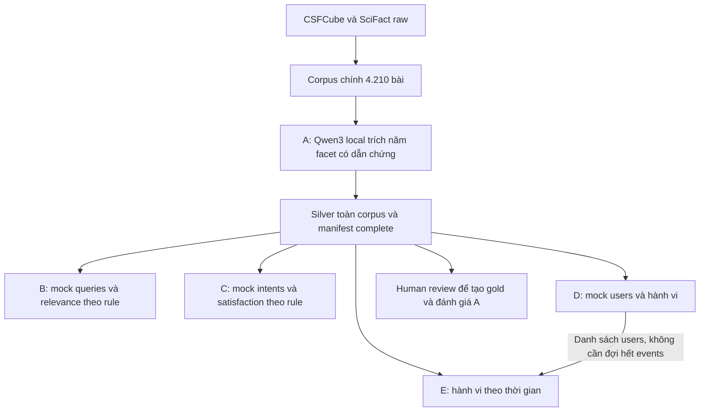

# Thực nghiệm khuyến nghị bài báo và hội nghị — DS300

Dùng corpus chính 4.210 bài. A đã có bộ chạy Qwen3 local `Qwen/Qwen3-4B-Instruct-2507` để trích
năm facet có dẫn chứng; 5 người chia nhau chạy 4.210 bài, mỗi người 842 bài,
chọn khoảng bằng `paper_range` trong config A. B–E
mock queries/intents/users/hành vi trên corpus thật và facet A. B/C/D làm
song song sau silver; E dùng chung users D. Chưa có gold hoặc kết quả mô hình.

## Mục lục

1. Trạng thái hiện tại và số liệu dữ liệu
2. Cấu trúc hệ thống và luồng xử lý
3. Các thực nghiệm và quan hệ phụ thuộc
4. Kế hoạch xây dataset và số lượng mục tiêu
5. Quy mô, pilot và điều kiện mở từng phần
6. Cấu trúc thư mục đầy đủ và vòng đời tệp
7. Contract, ID, provenance và định dạng dữ liệu
8. Năm facet dùng chung và silver/gold
9. Thực nghiệm A — Gán nhãn facet
10. Thực nghiệm B — Truy hồi theo facet
11. Thực nghiệm C — Ý định tường minh
12. Thực nghiệm D — Sở thích ngầm
13. Thực nghiệm E — Sở thích theo thời gian
14. Split và chống rò rỉ dữ liệu
15. Cách chạy các chức năng đã triển khai
16. Cấu hình, scope review và quy trình rebuild
17. Phạm vi IT, nhãn và trách nhiệm review
18. Kiểm tra, nghiệm thu và giới hạn hiện tại
19. Lộ trình dữ liệu và triển khai mô hình
20. Phần khuyến nghị hội nghị và các quyết định chưa chốt
21. Nguồn dữ liệu, Git và tài liệu tham chiếu

## 1. Trạng thái hiện tại và số liệu dữ liệu

| Hạng mục | Trạng thái thực tế |
|---|---|
| Dữ liệu gốc CSFCube | Đã tải bản v1.1, 4.207 bản ghi; giữ abstract, metadata, nhãn và cách chia gốc |
| Dữ liệu gốc SciFact | Đã tải 5.183 abstract; giữ claims, nhãn chứng cứ và cách chia gốc |
| Corpus IT chung | 4.210 bản ghi sau lọc phạm vi và gộp 25 bản ghi trùng |
| Đóng góp sau gộp | 4.182 bản ghi từ CSFCube và 28 bản ghi từ SciFact |
| Công cụ dữ liệu | Script tải, gộp corpus và kiểm tra chạy được |
| Kiểm tra | Corpus gate và kiểm tra offline đạt; xem docs/VALIDATION_STATUS.md |
| A local / mock B–E | A có code local, resume và validator; generator B–E chưa triển khai |
| Silver/gold năm facet | Chưa có; cần annotation và review chất lượng |

Số 4.210 là số bản ghi canonical hiện tại, còn mang tính tạm thời: có 5 trường hợp
cùng tiêu đề nhưng khác abstract được giữ riêng để review. SciFact còn 15 bản ghi
giáp ranh bị tạm loại. Corpus vượt mục tiêu tối thiểu 3.000 về số lượng, nhưng còn
thiếu 1.790 so với mục tiêu làm việc 6.000. Không thêm bản trùng hoặc dữ liệu giả
để lấp chỉ tiêu. Số lượng đạt mục tiêu không tự bảo đảm chất lượng thực nghiệm.

## 2. Cấu trúc hệ thống và luồng xử lý

Hệ thống được mô tả theo bốn lớp. Đây là **cấu trúc logic**, không khẳng định tất
cả thành phần đã có code hoặc phải xây thành các service riêng.

| Lớp | Chức năng | Trạng thái |
|---|---|---|
| Nguồn và corpus | Tải, giữ bản gốc; lọc IT; chuẩn hóa, gộp trùng và cấp ID ổn định | Đã triển khai |
| Facet và dataset | Gán năm facet; xây query, ý định, hành vi và hồ sơ thời gian A–E | A có bộ chạy Qwen3 local; B–E có đặc tả, chưa có generator/dataset |
| Biểu diễn và khuyến nghị | Biểu diễn nội dung/facet, truy hồi ứng viên, suy ra sở thích và xếp hạng theo chế độ | Giai đoạn sau; chưa chọn model/embedding/dimension |
| Đánh giá và sử dụng | Đọc nhãn đúng giao thức, so sánh kết quả, phân tích lỗi; giao diện khi có nhu cầu | Giai đoạn sau; chưa có kết quả hoặc UI |



Facet A dựa trên bài thật; B–E sinh tình huống và hành vi mock, không mock facet.
Không cần chờ human gold hoặc embedding model để bắt đầu xây B–E.

### Luồng dữ liệu đang chạy được

1. `download_sources.py` tải hoặc kiểm tra archive/tài liệu đã có; giải nén có
   kiểm tra đường dẫn và lưu checksum từng tệp nguồn.
2. `build_corpus.py` đọc catalog của hai nguồn, áp dụng scope và override có
   reviewer; ghi quyết định của mọi bản ghi vào audit.
3. Chuẩn hóa nội dung, tìm alias/trùng, bảo toàn ID và nguồn đại diện đã cấp;
   ghi corpus, ID map, báo cáo và manifest.
4. `validate_all.py --phase corpus` kiểm tra nguồn, hashes, schema và liên kết
   trực tiếp trên corpus chính.

### Luồng khuyến nghị dự kiến khi có mô hình

| Chế độ | Thông tin người dùng đưa vào | Thành phần dữ liệu hỗ trợ | Kết quả mong muốn |
|---|---|---|---|
| Theo facet | Bài đang đọc + một facet muốn tìm tương tự | A và B | Danh sách bài liên quan theo facet đó |
| Theo ý định | Bài đang đọc + yêu cầu/ràng buộc rõ ràng | A và C | Bài thỏa toàn bộ yêu cầu đã chỉ định |
| Theo sở thích ngầm | Lịch sử tương tác được phép quan sát | A và D | Bài phù hợp với sở thích suy ra |
| Theo sở thích hiện tại | Lịch sử có thời gian và cutoff rõ ràng | A và E | Bài phù hợp với mối quan tâm mới nhất |

Dataset định nghĩa đầu vào và đáp án, không quyết định thay model. Khi triển khai
mô hình, cần chốt candidate protocol, observable features và chỉ số trước khi chạy.
Không cho mô hình đọc đáp án, latent truth hoặc tương tác tương lai để xếp hạng.

## 3. Các thực nghiệm và quan hệ phụ thuộc

| Thực nghiệm | Câu hỏi chính | Dữ liệu cần chuẩn bị |
|---|---|---|
| [A — Trích xuất facet](data/exp_a/README.md) | Có xác định đúng vấn đề, tác vụ, phương pháp, dataset và đóng góp của bài không? | Nhãn silver tự động và gold được người kiểm tra |
| [B — Truy hồi theo facet](data/exp_b/README.md) | Từ một bài mẫu, có tìm được bài phù hợp theo một khía cạnh cụ thể không? | Query, tập ứng viên và nhãn mức liên quan |
| [C — Ý định tường minh](data/exp_c/README.md) | Có đáp ứng yêu cầu kết hợp như cùng vấn đề nhưng khác phương pháp không? | Ý định, ràng buộc năm facet và nhãn thỏa/không thỏa |
| [D — Sở thích ngầm](data/exp_d/README.md) | Có suy ra sở thích từ lịch sử tương tác thay vì yêu cầu người dùng khai báo không? | Người dùng giả lập, lịch sử, tương tác tương lai và sở thích ẩn |
| [E — Sở thích theo thời gian](data/exp_e/README.md) | Có theo dõi được sở thích thay đổi qua nhiều giai đoạn không? | Cùng người dùng D, hồ sơ từng giai đoạn và luồng tương tác riêng |

Ví dụ xuyên suốt: người dùng đang đọc một bài về hệ thống khuyến nghị. A xác định
bài nghiên cứu vấn đề gì và dùng phương pháp nào; B tìm các bài tương tự theo
phương pháp; C tìm bài cùng vấn đề nhưng dùng phương pháp khác; D suy ra người dùng
thường quan tâm chủ đề nào từ lịch sử; E xét việc mối quan tâm đó thay đổi theo thời
gian. Đây là ví dụ giải thích mục tiêu, không phải kết quả mô hình đã chạy.

**Quan hệ dữ liệu hiện tại:** A trích facet trên corpus chính; B/C/D dùng
silver đó và không phụ thuộc output nhau. E cần danh sách users D và tạo
stream riêng, không cần chờ D hoàn thành tương tác. Gold A phục vụ đánh giá
chất lượng annotation, không phải prerequisite để phát triển B–E.

### Đọc bảng này để xây dataset: đầu vào/đầu ra của generator

**Nguyên liệu → generator → dataset → mô hình thực nghiệm.** Generator được dùng
nguồn nhãn hoặc latent truth để xây đáp án; mô hình về sau chỉ được đọc phần input
quan sát được. Ví dụ `retrieval_queries.jsonl`, `intents.jsonl`, `users.jsonl` và
`interactions_train.jsonl` đều do generator tương ứng tạo, không tự có sẵn từ corpus.

| Dataset | Nguyên liệu generator đọc | Generator tạo gì? | Phụ thuộc |
|---|---|---|---|
| A | Corpus + prompt/guideline + Qwen3 local | Silver, evidence metadata, manifest | Trọng số Qwen3 và môi trường GPU |
| B | Corpus + silver A + sampling/relevance rule | Mock queries/candidates/labels/splits | A silver, rule và generator B |
| C | Corpus + silver A + intent templates/rules | Mock intents/satisfaction/splits | A silver, templates và generator C |
| D | Corpus + silver A + simulator config | Mock users/latent profiles/history/holdout | A silver và simulator D |
| E | Users D + corpus + silver A + drift config | Temporal profiles và stream E riêng | A silver, users D và simulator E |

B–E dùng năm facet; native CSFCube ba facet chỉ là benchmark bổ sung tùy chọn.
Generator B–E chưa triển khai. A có code local; số annotation thực tế xem manifest.

Các mục “đầu vào/đầu ra” A–E bên dưới giờ là **của generator**, còn cách mô hình
đọc dataset được tách ở cuối mục kiểm tra. Folder `data` là nguyên liệu và output
dataset; việc model sinh ranking/scores là phase khác.

## 4. Kế hoạch xây dataset và số lượng mục tiêu

| Phần | Công việc chuẩn bị dataset | Số lượng mục tiêu |
|---|---|---|
| Corpus | Xây corpus IT chung; lọc phạm vi, gộp trùng, giữ ID/provenance; chốt schema và kiểm tra/tích hợp A–E | 6.000 bài, tối thiểu 3.000; hiện 4.210 bản ghi tạm thời |
| A | 5 người cùng chạy trích facet theo khoảng riêng; guideline/prompt, nhãn tự động và review | Silver trên 4.210 bài hiện có, 842 bài/người; 400 bài gold là mục tiêu review riêng |
| B | Xây dataset B: bài truy vấn, ứng viên và nhãn mức liên quan theo facet | 300 query × 100 candidates = khoảng 30.000 cặp |
| C | Xây dataset C: yêu cầu tìm bài, ràng buộc và nhãn ứng viên có thỏa yêu cầu không | 1.500 cases; phân bổ theo loại intent được duyệt |
| D/E | Xây dataset D: user giả lập, sở thích ẩn và hành vi; dataset E: cùng users qua nhiều giai đoạn | D: 300 users × 50 = 15.000 interactions. E: 300 users × 4 = 1.200 profiles, khoảng 15.000–20.000 interactions |

Đây là mục tiêu làm việc, không phải dữ liệu đã hoàn thành. D và E không cộng
thành 600 users. Gold/silver là nhãn trên corpus, không phải corpus độc lập.
Số pair/case/event không bằng số bài độc lập và không được dùng để che lấp việc
corpus nhỏ hoặc nhãn thiếu chất lượng.

### Mốc bàn giao trước mắt

Corpus chính đã có; 5 người chia nhau chạy A silver, mỗi người 842 bài theo
[bảng khoảng trong README A](data/exp_a/README.md). Gom đủ năm phần và kiểm tra
coverage/dẫn chứng trước khi B/C/D dựng mock; D bàn giao users sớm cho E.
Không cần chờ human gold hoặc đủ 6.000 bài.

### Deliverables chung của từng thực nghiệm

- README giải thích format/rules, generator **chạy được**, bộ mẫu nhỏ và dataset
  đầy đủ khi các điều kiện đầu vào đã có.
- Manifest ghi contract/input/generator versions, seed, checksums và số bản ghi.
- Nhãn hoặc hidden truth tách đúng vai trò, có provenance; quy tắc split rõ ràng.
- Kiểm tra cấu trúc, ngữ nghĩa, tái lập và leakage; báo case skip, gap target và
  nhãn còn cần người review.

Thay đổi contract, vocabulary chung, ID map và split policy cần review trước
tích hợp. Mọi exp dùng cùng ID paper và corpus; chất lượng dataset cần kiểm tra,
không chỉ tạo đủ số dòng. Nhãn gold cần người kiểm tra, không được
thay bằng bộ sinh tự động để đủ 400 bài.

## 5. Quy mô, pilot và điều kiện mở từng phần

Chạy A silver trên toàn corpus trước; B–E làm pilot mock rồi mở rộng.
Gold A là mục tiêu review riêng, không chặn generator B–E khi silver đã có.

| Phần | Mục tiêu làm việc | Điều kiện cần trước khi sinh dataset |
|---|---|---|
| Corpus | 6.000 bài; tối thiểu 3.000 | Review phạm vi IT, provenance, ID và trường hợp nghi trùng |
| A | 400 bài gold; silver trên 4.210 bài, chia 5 phần × 842 bài | Guideline, từ vựng và quy trình review được chốt |
| B | 300 query × 100 ứng viên | Nguồn nhãn và quy tắc facet/relevance được duyệt |
| C | 1.500 trường hợp, khoảng 5–10 loại ý định | Facet đầu vào và ràng buộc từng loại ý định được chốt |
| D | 300 người dùng × 50 tương tác | Quy tắc hồ sơ ẩn, tiếp xúc bài và nhiễu được công bố |
| E | Cùng 300 người dùng × 4 giai đoạn; khoảng 15.000–20.000 tương tác | Danh tính D, khoảng thời gian, tỷ lệ ổn định/thay đổi và cutoff được chốt |

Đây là mục tiêu workload từ tài liệu bàn giao, không phải số đã tạo và không phải
bảo đảm nguồn nhãn thật đủ số lượng. Riêng D/E là hành vi mô phỏng nếu không có
dữ liệu người dùng thật; phải ghi rõ giới hạn này trong mọi báo cáo.


### Pilot trước khi mở rộng

Mỗi exp đọc corpus chính và silver A. Pilot chỉ giới hạn output query/case/user,
không dựng catalog mẫu hoặc facet giả.

| Phần | Mốc đầu tiên |
|---|---|
| A | `--limit 2` nếu cần kiểm tra local model; chạy tiếp toàn corpus và validate coverage |
| B | 5 query × 10 candidates trên năm facet A |
| C | 20 cases có positive/negative và missing facet |
| D | 5 users × 10 events; 6 history/4 future |
| E | Cùng 5 users D × 4 periods, ít nhất 2 events/user/period |

B–E vẫn ghi mock/synthetic dù dùng silver thật. Khi đổi input facet/rule, sinh
lại labels/splits/events và cập nhật hashes; thiếu ứng viên hợp lệ thì báo gap.

## 6. Cấu trúc thư mục đầy đủ và vòng đời tệp

```text
configs/                 Cấu hình seed, đường dẫn và quy tắc lọc IT
docs/                    Guideline, prompt, tài liệu phạm vi và báo cáo
schemas/                 Schema các bản ghi đang dùng
data/raw/csfcube/         Bản gốc CSFCube, nhãn, split và tài liệu nguồn
data/raw/scifact/         Bản gốc SciFact, claims, split và tài liệu nguồn
data/processed/          Corpus chung, ánh xạ ID, audit và manifest
data/exp_a/ ... exp_e/    README và các thư mục dữ liệu riêng của A–E
scripts/                 Các script dữ liệu đang chạy được
tests/                   Kiểm tra dữ liệu hợp lệ và các trường hợp lỗi
```

- `data/processed/papers.jsonl`: **corpus đầy đủ duy nhất**; dùng cho xử lý dữ liệu
  thật. Các thực nghiệm cùng tham chiếu `paper_id`, không lập corpus/ID riêng.
- `data/processed/id_map.jsonl`: ID nguồn → ID chung; giữ mọi nguồn gốc và nguồn
  đại diện của từng bài. ID đã cấp không đổi khi thêm nguồn hoặc đổi thứ tự.
- `data/processed/scope_audit.jsonl`: quyết định giữ/loại từng bản ghi và bằng chứng.
- `data/exp_a/generated/facets_silver.jsonl`: vị trí dự kiến nhãn tự động.
- `data/exp_a/generated/facets_gold.jsonl`: vị trí dự kiến nhãn đã được người review.
- `samples/generated/` và `samples/ground_truth/` của mỗi exp: output mock cần
  xây trước, cùng tên trường output thật nhưng manifest ghi `dataset_kind: mock`.
- `generated/`: dữ liệu đầy đủ của exp; `ground_truth/`: nhãn/hồ sơ ẩn/tương lai
  chỉ dành cho đánh giá. Không đưa chúng vào đầu vào dự đoán hoặc xây hồ sơ.

Silver/gold chỉ chứa nhãn và tham chiếu ID, không chép lại abstract. Một bài có thể
có cả silver và gold để so sánh. Nội dung thật không làm nhãn giả trở thành gold.


### Cây thư mục và các tệp quan trọng

Các tệp đánh dấu `[dự kiến]` chưa được tạo; cây không phải khẳng định mọi dataset
đã tồn tại. Các thư mục output hiện có có thể chỉ chứa `.gitkeep`.

```text
paper-and-conference-recommendation-experiments/
├── README.md
├── DATA_CONTRACT.md
├── .gitignore
├── configs/
│   ├── data.json
│   └── scope.json
├── docs/
│   ├── DATA_FIRST_REFERENCE.md
│   ├── FACET_GUIDELINE.md
│   ├── ANNOTATION_PROMPT.md
│   ├── EXPERIMENT_README_TEMPLATE.md
│   ├── IT_SCOPE.md
│   ├── INGESTION_REPORT.md
│   ├── IMPLEMENTATION_PLAN.md
│   └── VALIDATION_STATUS.md
├── schemas/
│   ├── paper.schema.json
│   ├── id_map.schema.json
│   └── scope_audit.schema.json
├── data/
│   ├── raw/
│   │   ├── README.md
│   │   ├── csfcube/       Archive, abstract/metadata, nhãn, split, giấy phép gốc
│   │   └── scifact/       Archive, corpus, claims, cross-validation, tài liệu gốc
│   ├── processed/
│   │   ├── README.md
│   │   ├── papers.jsonl
│   │   ├── id_map.jsonl
│   │   ├── scope_audit.jsonl
│   │   ├── corpus_report.json
│   │   ├── native_split_policy.json
│   │   └── manifest.json
│   ├── exp_a/
│   │   ├── README.md
│   │   ├── build_exp_a.py
│   │   ├── config.json
│   │   ├── .env.example
│   │   ├── samples/       Pilot local dùng output chính; không mock facet
│   │   ├── generated/    facets_silver/gold và annotation_metadata [dự kiến]
│   │   └── ground_truth/  Vị trí cho dữ liệu đánh giá cần tách riêng khi triển khai
│   ├── exp_b/
│   │   ├── README.md
│   │   ├── samples/
│   │   ├── generated/    retrieval_queries.jsonl [dự kiến]
│   │   └── ground_truth/  retrieval_labels.jsonl [dự kiến]
│   ├── exp_c/
│   │   ├── README.md
│   │   ├── samples/
│   │   ├── generated/    intents.jsonl [dự kiến]
│   │   └── ground_truth/  intent_labels.jsonl [dự kiến]
│   ├── exp_d/
│   │   ├── README.md
│   │   ├── samples/
│   │   ├── generated/    users, interactions_train [dự kiến]
│   │   └── ground_truth/  interactions_test, latent_user_profiles [dự kiến]
│   └── exp_e/
│       ├── README.md
│       ├── samples/
│       ├── generated/    interactions_train [dự kiến]; users đọc từ D
│       └── ground_truth/  interactions_test, temporal_profiles [dự kiến]
├── scripts/
│   ├── download_sources.py
│   ├── build_corpus.py
│   └── validate_all.py
└── tests/
    ├── test_data_validation.py
    └── test_exp_a.py
```

`raw` là bản gốc bất biến; `processed` là corpus chuẩn hóa có thể rebuild bằng
code và dùng trực tiếp cho tất cả exp. `samples/generated/` và
`samples/ground_truth/` chứa output mock của exp, chỉ tham chiếu ID corpus.
Output dùng nhãn đã annotation nằm ngoài `samples/`, tách input và truth.
Việc tách thư mục phải đi kèm loader allowlist, không chỉ dựa vào tên folder.
Schema A–E và script generator sẽ bổ sung khi thật sự có chức năng, không tạo
module rỗng. README từng exp là tài liệu chi tiết riêng; README này tổng hợp chúng.

## 7. Contract, ID, provenance và định dạng dữ liệu

[DATA_CONTRACT.md](DATA_CONTRACT.md) là nguồn quy ước chuẩn; các mô tả bên dưới
tóm tắt contract 1.0. Thay đổi ý nghĩa field/schema phải có phiên bản và Khải review.

| Hạng mục | Quy ước |
|---|---|
| Encoding | UTF-8; JSONL một object/dòng; JSON cho cấu hình và manifest |
| Paper ID | `P` + 6 chữ số, ví dụ `P000054` |
| User/query/intent ID | `U`/`Q`/`I` + 4 chữ số |
| Seed | 42 mặc định; đầu vào được sort trước sampling |
| Facet missing | `[]`, không null hoặc string đơn |
| Timestamp | ISO-8601 có timezone, ưu tiên UTC |
| Trọng số sở thích ẩn | Số hữu hạn trong [-1,1] |
| Version/provenance | Contract, input, generator, seed và actual counts trong manifest |

### Paper record

Corpus có `paper_id`, `source`, `source_id`, `title`, `abstract`, `year`, `domain`,
`scope_evidence`. `source_id` luôn là string; year là integer hợp lệ hoặc null.
Abstract chuẩn hóa chỉ nối các câu và thu gọn whitespace; bản raw vẫn giữ nguyên.
Domain IT có bằng chứng từ phạm vi nguồn hoặc quyết định filter/review, chưa phải
nhãn subject được người kiểm tra độc lập cho toàn corpus. Không nhét relevance,
intent labels hoặc latent preferences vào record bài.

### ID map và gộp trùng

Khóa nguồn `(source,source_id)` liên kết tới canonical `paper_id`. Một bài có thể
có nhiều alias, nhưng đúng một alias active được đánh dấu `primary` làm nguồn
đại diện. Nguồn đại diện không tự đổi khi thêm alias. `content_sha256` kiểm tra
record nguồn chuẩn hóa; `active=false` giữ ID lịch sử đã cấp khi bài bị loại.

Ưu tiên identifier chung; sau đó chỉ gộp title chuẩn hóa giống nhau khi abstract
cũng tương đương theo rule hiện có. Cùng title khác abstract giữ riêng để review.
Không gộp vì chủ đề giống; không xóa ID map để cấp lại ID khi rebuild. Xung đột
identifier hoặc thay đổi nguồn làm đổi nghĩa ID phải dừng và xử lý có phiên bản.

### Manifest và dữ liệu thật/mô phỏng

Manifest ghi dataset_kind, contract version, seed, generator version/hash,
input checksum và số records thật sự đã tạo. Không đưa thời điểm build vào phần
so sánh deterministic. Corpus luôn là real; manifest exp ghi mock cho lớp
nhãn/query/hành vi kiểm thử, đồng thời lưu path/hash corpus chính đã dùng.
Mọi paper_id đều resolve trong cùng corpus; không cấp ID cho catalog mock riêng.
Dataset dùng bài thật nhưng intent/user behavior sinh bằng code vẫn phải công bố
nguồn nhãn/hành vi synthetic, không đồng nhất mọi field với dữ liệu thu thập thật.

## 8. Năm facet dùng chung và silver/gold

| Khóa trong dữ liệu | Ý nghĩa | Cần phân biệt |
|---|---|---|
| `problem` | Vấn đề hoặc hạn chế nghiên cứu muốn giải quyết | Không đồng nhất với thao tác của hệ thống |
| `task` | Tác vụ cần thực hiện, như truy hồi hoặc phân loại | Không phải tên thuật toán |
| `method` | Thuật toán hoặc kỹ thuật thực sự được sử dụng | Không tự động là đóng góp mới |
| `dataset` | Tên bộ dữ liệu/tài nguyên được dùng và có bằng chứng | Không suy từ lĩnh vực hay tên hội nghị |
| `contribution` | Đóng góp mới được bài khẳng định và có căn cứ | Không sao chép chung chung từ phương pháp |

Mỗi facet là danh sách chuỗi; không có bằng chứng thì dùng `[]`. Tuy nhiên,
**chưa annotation** khác với **đã annotation nhưng không tìm thấy giá trị**.
Hiện chưa tạo `facets.jsonl` để tránh biến danh sách rỗng thành nhãn giả.
Facet gốc `background/method/result` của CSFCube là một hệ khác, chưa có quy tắc
chuyển sang năm facet trên được duyệt. Nhãn SUPPORT/CONTRADICT của SciFact là nhãn
kiểm chứng phát biểu, không phải nhãn khuyến nghị bài báo.


**Silver** là annotation tự động có nguồn/model/prompt/version rõ ràng.
**Gold** là annotation đã qua human review theo guideline, không phải tên khác
của silver. Có thể cùng một bài có cả hai tier để đánh giá A. Gold thật cần
quy trình xử lý bất đồng và tập held-out; không dùng held-out để chỉnh prompt.
Review scope IT, native relevance hay nhãn câu của nguồn không thay thế gold
năm facet. B–E dùng silver A; review để tạo gold tiến hành riêng, không cần
chờ gold để xây các generator mock.

## 9. Thực nghiệm A — Trích năm facet bằng Qwen3 local

Cả nhóm 5 người cùng chạy trích facet trên 4.210 title/abstract, chia thành
5 phần không trùng nhau, mỗi người 842 bài. Chạy Qwen3 trên máy, không dùng
API key. Corpus thật và schema năm facet vẫn dùng chung B–E.

### 9.1. Mục đích

Trích problem, task, method, dataset, contribution từ title/abstract thật.
Output tự động là silver, cần review chất lượng; không tự tạo human gold.
Không thay năm facet bằng ba nhãn câu gốc CSFCube hoặc facet mock.

### 9.2. Đầu vào

| Input | Đường dẫn/giá trị |
|---|---|
| Corpus | `data/processed/papers.jsonl`, toàn bộ 4.210 bài |
| Config | `data/exp_a/config.json` |
| Khoảng bài | `paper_range: [bài_đầu, bài_cuối]`, mặc định `[1, 842]` |
| Thư mục kết quả | `output_dir`, mặc định `data/exp_a/generated/part_1` |
| Model | `Qwen/Qwen3-4B-Instruct-2507`, revision cố định trong config |
| Thiết bị | `cuda`; đã kiểm tra máy có RTX 4060 Laptop 8 GB |
| Prompt/guideline | `docs/ANNOTATION_PROMPT.md`, `docs/FACET_GUIDELINE.md` |
| Trọng số/cache | `models/huggingface/`, Git bỏ qua |

Trọng số tải từ Hugging Face lần đầu. Suy luận chạy trên máy; title/abstract
không gửi tới dịch vụ annotation. Bản Instruct này không có thinking. Dùng NF4 4-bit (bitsandbytes), tính toán float16 trên GPU.

#### Chia 4.210 bài cho 5 người

Số thứ tự bắt đầu từ **1**, sau khi sắp corpus tăng dần theo `paper_id`;
**lấy cả bài đầu và bài cuối**. Giữ nguyên corpus, không cắt thành năm tệp.

| Phần chạy | `paper_range` | Paper IDs | Số bài | `output_dir` |
|---|---|---|---|---|
| Phần 1 | `[1, 842]` | `P000001`–`P000842` | 842 | `data/exp_a/generated/part_1` |
| Phần 2 | `[843, 1684]` | `P000843`–`P001684` | 842 | `data/exp_a/generated/part_2` |
| Phần 3 | `[1685, 2526]` | `P001685`–`P002526` | 842 | `data/exp_a/generated/part_3` |
| Phần 4 | `[2527, 3368]` | `P002527`–`P003368` | 842 | `data/exp_a/generated/part_4` |
| Phần 5 | `[3369, 4210]` | `P003369`–`P004210` | 842 | `data/exp_a/generated/part_5` |

Mỗi người chọn một phần và sửa **hai giá trị** `paper_range`, `output_dir`
trong config trên máy mình. Ví dụ phần 2 (chỉ trích hai trường cần sửa):

```json
{
  "paper_range": [843, 1684],
  "output_dir": "data/exp_a/generated/part_2"
}
```

Giữ các trường config còn lại. `[1, null]` chọn toàn corpus; `[3369, null]`
chọn từ bài 3.369 tới cuối. Bỏ `paper_range` cũng chọn toàn corpus để tương thích
config cũ. Khoảng đảo ngược, ngoài corpus hoặc không phải số nguyên sẽ báo lỗi
trước khi nạp model. Khi corpus thay đổi phải chia lại khoảng theo số bài thực tế.

### 9.3. Đầu ra

Tệp của từng phần nằm trong `output_dir` tương ứng, ví dụ
`data/exp_a/generated/part_1/`:

| Tệp | Vai trò |
|---|---|
| `facets_silver.jsonl` | ID và đúng năm list concept string |
| `annotation_metadata.jsonl` | Câu dẫn chứng nguyên văn, model/revision/runtime, token count, seed/attempt |
| `manifest.json` | Hashes, coverage, missing IDs, partial/complete |
| `.exp_a_checkpoint.sqlite3` | Lưu từng bài hợp lệ để tiếp tục; không commit Git |
| `last_failure.json` nếu lỗi | Paper ID, lỗi kiểm tra và output cuối để rà lại |

Manifest giữ `corpus_count: 4210` và coverage của **toàn corpus**; một phần đủ
842 bài vẫn có `status: partial`, các ID ngoài khoảng vẫn nằm trong `missing_ids`.
Kiểm tra từng phần bằng `--validate-only --allow-partial`; đối chiếu các ID còn
thiếu **trong khoảng được giao** để biết phần đó đã xong chưa. Khi gom năm phần,
ghép cả silver và metadata theo `paper_id`, kiểm tra không trùng/thiếu và tạo
manifest cho bộ đầy đủ ở `data/exp_a/generated/` trước khi bàn giao B–E.
Không dùng manifest của một phần làm manifest toàn corpus.

Lượt gọi API cũ chưa tạo annotation nào; checkpoint/output lỗi được giữ tại
`generated/api_attempt_backup/`. Qwen không trộn provenance API vào silver mới. Pilot v1.3 bị loại do nhãn
chép định nghĩa; giữ để audit ở `generated/pilot_rejected_v13/`. Các pilot trước khi chỉnh prompt/feedback nằm trong `pilot_rejected_v14/` và `pilot_before_feedback/`; không trộn vào silver hiện tại.

### 9.4. Quy tắc nhãn

Qwen chọn concept và evidence_id từ các câu đánh số T0/A0/A1... của bài.
Code lấy nguyên văn câu đã chọn và xác định source title/abstract, không yêu cầu
model chép lại câu dài. Metadata giữ cả sentence selections. Concept phải là cụm từ thực sự xuất hiện
trong câu đã chọn (so khớp sau chuẩn hóa case/dấu câu); không chấp nhận định nghĩa
chung hoặc diễn đạt lại. Đây là chế độ trích cụm từ, không sinh nhãn tùy ý. Code kiểm tra
đúng ID/khóa/list, không trùng concept và câu dẫn chứng có trong bài. Không có
bằng chứng dùng `[]`; chưa xử lý không được chèn nhãn rỗng giả. Metadata ghi
`annotator_type: qwen_local`, `tier: silver`, `review_status: unreviewed`.

JSON được yêu cầu bằng prompt và kiểm tra sau sinh; không có bảo đảm schema từ
dịch vụ API. Sai JSON/ID thì yêu cầu model sửa tối đa max_attempts lần. Hết
lượt vẫn sai thì ghi lỗi theo paper_id vào checkpoint và `manifest.failed_annotations`, giữ ID đó trong `missing_ids` rồi tiếp tục các bài khác. Không chèn annotation giả cho bài lỗi. Chạy lại cùng lệnh sẽ thử lại các ID còn thiếu. Lỗi môi trường/GPU vẫn dừng tiến trình.
Câu trích có thật vẫn có thể không hỗ trợ concept: cần người review ngữ nghĩa.

### 9.5. Cách chạy

Môi trường riêng `.venv-qwen` dùng Python 3.11, PyTorch CUDA và Transformers.
Nếu đã có môi trường này, lệnh quen thuộc tự chuyển sang đúng Python. Từ folder
`data/exp_a`:

```powershell
python build_exp_a.py --dry-run
python build_exp_a.py --limit 2
python build_exp_a.py
python build_exp_a.py --validate-only --allow-partial
```

Không cần `.env`. `--dry-run` hiển thị khoảng, IDs, số bài được chọn và thư mục
kết quả để kiểm tra trước khi chạy. Mặc định chỉ xử lý bài còn thiếu **trong
`paper_range`**; `--limit` là số bài mới tối đa trong khoảng đó, không thay đổi
ranh giới phần chạy. Config hiện chọn phần 1; đổi khoảng/thư mục trước khi chạy
phần khác. Chạy lại cùng config sẽ tiếp tục checkpoint của phần đó.

Nếu thiết lập lại máy, từ thư mục gốc dự án dùng Python 3.11:

```powershell
python -m venv .venv-qwen
.\.venv-qwen\Scripts\python.exe -X utf8 -m pip install torch==2.6.0 --index-url https://download.pytorch.org/whl/cu124
.\.venv-qwen\Scripts\python.exe -X utf8 -m pip install -r data/exp_a/requirements.txt
```

### 9.6. Tiến độ và tái lập

Model được nạp một lần mỗi tiến trình, xử lý tuần tự và lưu từng bài ngay sau
kiểm tra. Năm người chạy trên máy riêng với cùng corpus/model/prompt; mỗi phần
có output/checkpoint riêng. OS lock chặn hai lượt chạy cùng output. Dừng rồi chạy lại cùng lệnh
tiếp tục bài thiếu. Checkpoint chưa có annotation nào được khởi tạo lại khi đổi cấu hình.
Nếu đã có annotation, đổi khoảng bài, model/revision/prompt/thiết bị/tham số
sampling hoặc code generator thì dùng output mới;
max_new_tokens/max_attempts có thể tăng để tiếp tục checkpoint.
Seed/phiên bản được ghi để truy nguồn, không bảo đảm kết quả giống hệt trên GPU khác.

### 9.7. Nghiệm thu

Chạy tests, corpus gate và validator từng phần. Chỉ bộ đã gom đủ 4.210 IDs,
metadata tương ứng và manifest toàn corpus hợp lệ với `status: complete` mới
được bàn giao cho B–E. B/C/D sinh dataset mock song
song trên facet A; E còn cần users D. Không cần chờ gold; đánh giá chất lượng
A vẫn cần human-reviewed gold riêng, không tự chấm bằng chính silver. Prompt v1.5 dùng P000001 làm ví dụ phát triển prompt; bài này không được đưa vào held-out gold.

Các tệp JSONL/manifest được xuất khi lượt chạy kết thúc hoặc dừng có xử lý;
tiến độ bền vững nằm trong checkpoint riêng của mỗi phần. Output/checkpoint
của lượt toàn corpus cũ ở `generated/` không phải output của năm phần mới.
Không chạy hai tiến trình cùng `output_dir`. Kiểm tra dẫn chứng không bảo đảm
chọn đúng facet hoặc trích đủ ý; các nhãn vẫn là silver chưa review.

Nguồn: [model card Qwen3-4B-Instruct-2507](https://huggingface.co/Qwen/Qwen3-4B-Instruct-2507),
[PyTorch CUDA 12.4](https://pytorch.org/get-started/previous-versions/#v260).

## 10. Thực nghiệm B — Truy hồi bài báo theo một facet

Trạng thái: ưu tiên dựng mock data để kiểm thử trước;
chưa sinh dataset hoặc chạy mô hình của thực nghiệm.

**README này mô tả cách xây dataset.** Generator đọc nguyên liệu/cấu hình,
tạo cả dữ liệu quan sát được và nhãn/truth. Đầu vào mô hình là một phần của
dataset đã tạo, được nói riêng ở cuối; không coi output generator là prerequisite.

**Dùng trực tiếp corpus chính cho mọi exp:** `data/processed/papers.jsonl`
(4.210 bài hiện có), giữ nguyên title/abstract và `paper_id`. Generator đọc catalog
này rồi chọn query/candidates theo config; không dựng bộ bài 50 mẫu hoặc catalog
mock riêng. Các mốc pilot dưới đây chỉ giới hạn số query/case/user/events đầu ra.

**Facet dùng chung là silver do A trích từ bài thật:**
`data/exp_a/generated/facets_silver.jsonl`, kèm metadata/dẫn chứng và manifest
có `status: complete`. Năm facet: `problem`, `task`, `method`, `dataset`,
`contribution`. Không sinh facet giả hoặc thay title/abstract để khớp nhãn.
Mock của B–E là queries/intents/nhãn theo rule/users/hành vi; không phải mock corpus
hay mock facet. B/C/D không cần kết quả của nhau hoặc human gold A; E cần users D.

Output pilot ở `samples/generated/` và `samples/ground_truth/`; bộ mở rộng ở
`generated/` và `ground_truth/` trực tiếp dưới exp. Cả hai vẫn ghi
`dataset_kind: mock` nếu query/nhãn/hành vi được sinh tự động. Manifest ghi hash
corpus và facets A, seed 42, rule version và actual counts. Generator B–E chưa
được triển khai; A đã có bộ chạy Qwen3 local. Facet `[]` là thiếu bằng chứng, không phải
bài chưa annotation; chỉ chọn bài đủ thông tin cho rule đang xét.

### 10.1. Mục đích của dataset

B kiểm tra khả năng tìm bài liên quan theo **một khía cạnh được chỉ định** khi
đầu vào là một bài mẫu. Hai bài cùng lĩnh vực chưa chắc giống phương pháp; hai bài
khác ứng dụng vẫn có thể dùng phương pháp tương tự. Vì vậy relevance phải gắn
với facet của query, không chỉ với chủ đề chung.

Ví dụ: người đọc muốn tìm các bài dùng phương pháp tương tự bài đang đọc.
Dataset B cần bài truy vấn, tập ứng viên cố định và mức liên quan của từng ứng
viên. Chất lượng thứ tự xếp hạng là bước đánh giá mô hình về sau.

### 10.2. Đầu vào của generator xây dataset

Generator B đọc **corpus chính + năm facet silver A + cấu hình sampling/relevance**,
rồi tạo query, candidates và labels. Dùng facets silver A; không cần
human gold A hoặc judgments CSFCube để bắt đầu.

| Đầu vào | Đường dẫn | Vai trò |
|---|---|---|
| Corpus chính `[đã có]` | `data/processed/papers.jsonl` | Bài truy vấn và ứng viên dùng cùng IDs |
| Facets silver A `[cần chạy Qwen3]` | `data/exp_a/generated/facets_silver.jsonl` | Năm facet được trích từ title/abstract, có dẫn chứng |
| Cấu hình B `[cần xây]` | `configs/exp_b.json` | `dataset_kind: mock`, seed 42, 5 queries × 10 candidates, facet, rule version và split policy |

`target_facet` chỉ nhận `problem`, `task`, `method`, `dataset`, `contribution`.
Generator không đọc `retrieval_queries.jsonl` như nguyên liệu có sẵn: đây là output.
Tuân thủ [contract chung](DATA_CONTRACT.md); loader chọn đúng corpus chính.
Thiếu prerequisite thì báo lỗi; không tự chuyển giữa mock và real.

Ba facet `background/method/result` và nhãn 0–3 của CSFCube giữ ở raw. Benchmark
native chỉ là hướng bổ sung về sau nếu nhóm cần, không thay B năm facet và không
nằm trên luồng mock hiện tại. SciFact SUPPORT/CONTRADICT không phải relevance B.

### 10.3. Đầu ra của generator xây dataset

| Output mock `[chưa tạo]` | Nội dung |
|---|---|
| `data/exp_b/samples/generated/retrieval_queries.jsonl` | query_id, query_paper_id, target_facet, candidate_ids |
| `data/exp_b/samples/ground_truth/retrieval_labels.jsonl` | Nhãn 0/1/2 cho mỗi cặp query/candidate |
| `data/exp_b/samples/ground_truth/label_provenance.jsonl` | Nguồn synthetic, rule version và input facets |
| `data/exp_b/samples/generated/splits.json` | Chia theo nhóm bài truy vấn |
| `data/exp_b/samples/generated/manifest.json` | Kind mock, seed, hashes, số query/pair, skipped và gap |

Mốc đầu: 5 query × 10 candidates = 50 cặp, ưu tiên phủ đủ năm target facets.
Query và nhãn đều do builder tạo. Nhãn phục vụ kiểm thử, không phải người gán.
Khi mở rộng, giữ corpus/facets A; output chuyển về
`data/exp_b/generated/` và `data/exp_b/ground_truth/`. Mục tiêu mở rộng
300 query × 100 candidates chỉ áp dụng khi có đủ bài và nhãn hợp lệ.

### 10.4. Các trường trong dataset đầu ra

| Trường | Ý nghĩa/ràng buộc |
|---|---|
| `query_id` | `Q` + 4 chữ số; duy nhất trong bộ |
| `query_paper_id` | ID bài làm ví dụ truy vấn |
| `target_facet` | Một trong năm khóa `problem/task/method/dataset/contribution` |
| `candidate_ids` | List ID canonical; không trùng; không chứa query paper |
| `candidate_id` trong nhãn | Phải thuộc candidate set của query đó |
| `relevance` nội bộ | Đề xuất 0: không liên quan, 1: một phần, 2: cao |

Khóa duy nhất của nhãn: `(query_id,candidate_id)`. Đề xuất rule mock: trên facet
đích có dữ liệu, hai tập concept bằng nhau → 2; giao nhau nhưng khác tập → 1;
không giao nhau → 0. Thiếu facet đích ở anchor/candidate → ineligible.
Ghi rule/alias version trong config trước khi sinh. Đây là đáp án của kịch
bản mock, chưa đại diện đầy đủ cho tương đồng ngữ nghĩa trên bài thật.
Hard negative có facet khác giống anchor nhưng facet đích không giao nhau;
easy negative khác cả facet đích lẫn các facet được rule dùng để chọn mẫu.

### 10.5. Ví dụ generator: nguyên liệu → các tệp dataset

Giả sử facets A thực tế có method `["matrix factorization"]` cho cả `P000001`
và `P000002`, rule mock cho relevance 2. Ví dụ này chỉ minh họa schema;
chỉ dùng cặp bài đó khi nhãn A thực tế xác nhận, không hardcode vào generator. Title/abstract/IDs giữ nguyên từ
corpus chính. Ví dụ hiển thị một candidate; pilot dự kiến có 10 candidates/query.

**Đầu vào generator: các đường dẫn và một phần config dự kiến** (chưa phải
config hoàn chỉnh/chưa đảm bảo rule đã được chốt):

```json
{
  "corpus_path": "data/processed/papers.jsonl",
  "facets_path": "data/exp_a/generated/facets_silver.jsonl",
  "dataset_kind": "mock",
  "seed": 42,
  "num_queries": 5,
  "candidates_per_query": 10,
  "label_rule_version": "requires-rule-review"
}
```

**Records generator sẽ ghi vào các tệp đầu ra:**

```json
{
  "query_id": "Q0001",
  "query_paper_id": "P000001",
  "target_facet": "method",
  "candidate_ids": [
    "P000002"
  ]
}
```

```json
{
  "query_id": "Q0001",
  "candidate_id": "P000002",
  "relevance": 2
}
```

### 10.6. Các bước generator phải thực hiện

1. Đọc corpus chính và facets silver A, config và rule version; join theo paper_id.
2. Chọn anchor có facet đích; tạo positive, partial, hard/easy negative theo rule.
3. Chọn 5 queries × 10 candidates bằng seed 42; loại self-candidate và ID trùng.
4. Sinh đủ nhãn cho chính candidate set đã chọn; chưa có nhãn không tự bằng 0.
5. Chia theo nhóm anchor để cùng bài truy vấn không tràn các split.
6. Ghi query, labels, provenance và manifest; kiểm tra refs, positives và leakage.
7. Chạy lại cùng input/seed để kiểm tra tái lập. Thiếu candidates thì báo gap.

Khi mở rộng hoặc cập nhật facets A, sinh lại candidates/labels/splits theo
input version đã ghi. Nhãn sinh bằng rule vẫn ghi synthetic; chất lượng đánh giá
thật cần review riêng.

**Chưa có generator mock B hoặc lệnh chạy nó.** Việc cập nhật README chưa tạo dataset.

### 10.7. Kiểm tra dataset và nghiệm thu

- Query/candidate resolve trong đúng catalog; không self-candidate hoặc trùng ID.
- Nhãn không thừa/thiếu/nhân đôi so với chính sách judged đã công bố.
- Positive tồn tại; nguồn/scale/mapping relevance có giải thích, không trộn ngầm.
- Query anchors không tràn các split tùy chỉnh; nhãn không nằm trong input dự đoán.
- Manifest ghi mock/synthetic, actual counts, rule version và mọi pair còn unjudged.

Mốc mock B hoàn tất khi generator tái lập trên corpus chính kèm facets silver A năm facet, đủ mẫu hợp lệ,
manifest ghi mock và kiểm tra cấu trúc/rule/leakage đạt. Mốc này dùng silver A nhưng không yêu cầu
human gold A hoặc native CSFCube. Đánh giá B với nhãn được kiểm chứng là bước tiếp theo.

Lệnh hiện có `python scripts/validate_all.py --dataset-kind real --phase corpus`
chỉ kiểm tra corpus chính. `--phase experiments` trả lỗi vì dataset/generator
và validator đầy đủ A–E chưa được triển khai. Kiểm tra corpus đạt không thay thế
review chất lượng nhãn, ngữ nghĩa hoặc giả thuyết bộ mô phỏng.

#### Tách riêng: mô hình dùng dataset đã tạo thế nào?

Mô hình B đọc retrieval_queries và corpus/facets được phép; nhãn relevance giữ cho evaluation. Mô hình tạo ranking/scores, không tạo candidate catalog/ground truth thay generator.

## 11. Thực nghiệm C — Khuyến nghị theo ý định tường minh

Trạng thái: ưu tiên dựng mock data để kiểm thử trước;
chưa sinh dataset hoặc chạy mô hình của thực nghiệm.

**README này mô tả cách xây dataset.** Generator đọc nguyên liệu/cấu hình,
tạo cả dữ liệu quan sát được và nhãn/truth. Đầu vào mô hình là một phần của
dataset đã tạo, được nói riêng ở cuối; không coi output generator là prerequisite.

**Dùng trực tiếp corpus chính cho mọi exp:** `data/processed/papers.jsonl`
(4.210 bài hiện có), giữ nguyên title/abstract và `paper_id`. Generator đọc catalog
này rồi chọn query/candidates theo config; không dựng bộ bài 50 mẫu hoặc catalog
mock riêng. Các mốc pilot dưới đây chỉ giới hạn số query/case/user/events đầu ra.

**Facet dùng chung là silver do A trích từ bài thật:**
`data/exp_a/generated/facets_silver.jsonl`, kèm metadata/dẫn chứng và manifest
có `status: complete`. Năm facet: `problem`, `task`, `method`, `dataset`,
`contribution`. Không sinh facet giả hoặc thay title/abstract để khớp nhãn.
Mock của B–E là queries/intents/nhãn theo rule/users/hành vi; không phải mock corpus
hay mock facet. B/C/D không cần kết quả của nhau hoặc human gold A; E cần users D.

Output pilot ở `samples/generated/` và `samples/ground_truth/`; bộ mở rộng ở
`generated/` và `ground_truth/` trực tiếp dưới exp. Cả hai vẫn ghi
`dataset_kind: mock` nếu query/nhãn/hành vi được sinh tự động. Manifest ghi hash
corpus và facets A, seed 42, rule version và actual counts. Generator B–E chưa
được triển khai; A đã có bộ chạy Qwen3 local. Facet `[]` là thiếu bằng chứng, không phải
bài chưa annotation; chỉ chọn bài đủ thông tin cho rule đang xét.

### 11.1. Mục đích của dataset

C xét yêu cầu người dùng nói rõ, có thể kết hợp **nhiều facet và nhiều hướng**.
Khác với B chỉ hỏi một facet, C có thể yêu cầu “cùng vấn đề nhưng dùng phương pháp
khác”, hoặc “cùng phương pháp nhưng khác vấn đề”. Mục tiêu dữ liệu là xác định
ứng viên có thỏa toàn bộ ràng buộc không.

Ví dụ cùng vấn đề nhưng khác phương pháp: ứng viên chỉ giống vấn đề mà vẫn dùng
phương pháp cũ là một hard negative hữu ích. Chỉ tên intent không đủ định nghĩa
đáp án; phải có constraints và quy tắc so sánh được công bố.

### 11.2. Đầu vào của generator xây dataset

Generator C nhận **catalog/facets và templates**, rồi tự tạo các yêu cầu/đáp án.
`intents.jsonl` chưa có sẵn: đó là một trong các output phải sinh.

| Đầu vào generator | Đường dẫn/giá trị | Vai trò |
|---|---|---|
| Corpus chính `[đã có]` | `data/processed/papers.jsonl` | Bài làm anchor và tập bài eligible |
| Facets silver A `[cần chạy Qwen3]` | `data/exp_a/generated/facets_silver.jsonl` | Biết concept của các bài để chọn và chấm ứng viên |
| Intent templates `[cần xây]` | Đề xuất `configs/intent_templates.json` | Mỗi loại intent định nghĩa đủ năm directions, không chỉ tên loại |
| Rule/alias đã duyệt `[cần chốt]` | Theo contract/guideline và config version | Định nghĩa similar/different/ignore và xử lý missing |
| Cấu hình C `[cần xây]` | Đề xuất `configs/exp_c.json` | Kind mock, seed, 20 cases thử nhỏ; sau đó mục tiêu 1.500 cases, phân bổ types, số candidates/case, sampling và split policy |

Số candidates/case C chưa được chốt; không suy từ B rằng C luôn có 100 candidates.
Không cần đọc labels B để tạo C. Nếu muốn dùng nguồn nhãn khác phải công bố mode
và provenance riêng. Facet missing làm bài ineligible ở constraint đó.

**Các đường dẫn trong bảng tính từ thư mục gốc dự án**, không từ folder exp.
Tệp `[đã có]` có thể đọc ngay. Tệp/cấu hình `[cần xây]` là đề xuất interface cho
việc triển khai, chưa tồn tại và cần chốt trước khi viết/chạy generator.
Generator phải kiểm tra prerequisite, không âm thầm thay tệp thiếu bằng nhãn giả.
Tuân thủ [contract chung](DATA_CONTRACT.md), dùng cùng `paper_id`.

### 11.3. Đầu ra mock của generator xây dataset

| Đầu ra generator C `[chưa tạo]` | Nội dung |
|---|---|
| `data/exp_c/samples/generated/intents.jsonl` | Case ID, query paper, type, constraints, candidate IDs |
| `data/exp_c/samples/ground_truth/intent_labels.jsonl` | Mỗi candidate có satisfies_intent boolean |
| `data/exp_c/samples/generated/splits.json` `[đề xuất]` | Mapping case theo nhóm query paper |
| `data/exp_c/samples/generated/generation_report.json` `[đề xuất]` | Số case/type và lý do skip khi không đủ ứng viên |
| `data/exp_c/samples/generated/manifest.json` | Input facet/template/rule hashes, seed và actual counts |

Builder tạo cả yêu cầu và nhãn bằng facets/rules đầu vào. Nhãn như vậy là
rule-based/synthetic, không mặc nhiên là người thật xác nhận ý định; ghi provenance.
Mốc mock đầu: 20 cases. Mục tiêu mở rộng 1.500 cases không có nghĩa có 1.500 anchor papers độc lập.

### 11.4. Các trường trong dataset đầu ra

| Trường | Ý nghĩa |
|---|---|
| `intent_id` | `I` + 4 chữ số; duy nhất |
| `query_paper_id` | Bài làm mốc so sánh |
| `intent_type` | Tên template đã được duyệt và versioned |
| `constraints` | Đủ `problem/task/method/dataset/contribution` |
| Direction | `similar`: tương tự; `different`: khác; `ignore`: không xét |
| `candidate_ids` | ID chung, không trùng hoặc chứa bài truy vấn |
| `satisfies_intent` | Boolean của cặp `(intent_id,candidate_id)` |

Đề xuất cho pilot theo concept chuẩn hóa: `similar` khi có concept chung;
`different` khi hai tập concept đều có dữ liệu và không giao nhau. Tất cả facet
không ignore phải được thỏa đồng thời. Bài truy vấn/ứng viên thiếu facet đang xét
là chưa đủ điều kiện, không tự thành `different`. Đây là quy tắc pilot cần duyệt,
không khẳng định exact match thể hiện đầy đủ tương đồng ngữ nghĩa.

Tám intent types đề xuất: same_problem, same_problem_different_method,
same_method_different_problem, similar_task, different_dataset,
same_problem_same_method, similar_contribution, mixed_intent. Exact templates
và quota chưa duyệt; tên loại không tự định nghĩa labels.

### 11.5. Ví dụ generator: nguyên liệu → các tệp dataset

Đầu vào builder là catalog/facets, config và template, chưa phải danh sách
intents. Giả sử template same_problem_different_method đã được duyệt, builder
chọn anchor và ứng viên, kiểm tra concept, rồi sinh một case và nhãn dưới đây.
Trong kịch bản mock minh họa, hai bài chung problem và có method khác nhau; ví dụ chỉ minh họa schema; builder phải kiểm tra quan hệ trên facets A thực tế.

**Đầu vào generator: các đường dẫn và một phần config dự kiến** (chưa phải
config hoàn chỉnh/chưa đảm bảo rule đã được chốt):

```json
{
  "corpus_path": "data/processed/papers.jsonl",
  "facets_path": "data/exp_a/generated/facets_silver.jsonl",
  "templates_path": "configs/intent_templates.json",
  "dataset_kind": "mock",
  "seed": 42,
  "num_cases": 20
}
```

**Records generator sẽ ghi vào các tệp đầu ra:**

```json
{
  "intent_id": "I0001",
  "query_paper_id": "P000001",
  "intent_type": "same_problem_different_method",
  "constraints": {
    "problem": "similar",
    "task": "ignore",
    "method": "different",
    "dataset": "ignore",
    "contribution": "ignore"
  },
  "candidate_ids": [
    "P000003"
  ]
}
```

```json
{
  "intent_id": "I0001",
  "candidate_id": "P000003",
  "satisfies_intent": true
}
```

### 11.6. Các bước generator phải thực hiện

1. Đọc config, corpus, facets, templates/rule versions; join theo paper_id và
   kiểm tra template có đủ năm directions hợp lệ.
2. Chọn intent type theo quota, sau đó chọn anchor đủ facet cho type đó.
3. So facet anchor với các bài eligible theo từng constraint. Pilot đề xuất
   similar = có concept chung, different = hai tập nonempty không giao nhau,
   ignore = không xét; phải chốt rule/alias trước khi dùng.
4. Candidate positive phải thỏa mọi constraint. Negative vi phạm ít nhất một;
   hard negative ưu tiên vi phạm đúng một constraint khi khả thi.
5. Sample candidates theo config và seed, bỏ self/trùng; thiếu positive/negative
   thì skip case và báo lý do, không bịa satisfaction label.
6. Cấp intent_id; ghi intents và nhãn cho từng pair. Chia nhóm theo anchor,
   không random các case cùng anchor sang train/test khác nhau.
7. Ghi report/manifest, kiểm tra labels khớp rule, refs và coverage types.

Sau mock 20 cases, target mở rộng 1.500: phân bổ đề xuất 6 types × 200 + 2 types × 150. Tám types được đề
xuất trong phần field/rules trước; chốt exact templates/quota trước release.


**Chưa có generator mock C.** Bộ chạy A đã có; cần chạy Qwen3 để bàn giao silver.

#### Khi cập nhật facets A

Giữ corpus/IDs; khi facets hoặc alias/rule thay đổi, chạy lại generator
để sinh lại labels/splits/events và cập nhật input hashes. Cả pilot và
bộ mở rộng vẫn công bố phần nhãn/hành vi synthetic, không tự đổi thành real.

### 11.7. Kiểm tra dataset và nghiệm thu

**Mốc hiện tại là nghiệm thu mock:** manifest ghi `dataset_kind: mock`, references
thuộc cùng catalog, generator tái lập và các kiểm tra bên dưới đạt. Human
gold A và số lượng mục tiêu đầy đủ không phải điều kiện bắt đầu mock;
facet silver A đủ coverage là đầu vào cần có.

- IDs resolve; constraints đúng năm khóa và enums, khớp template đã duyệt.
- Mỗi pair có đúng một boolean label; candidate sets không trùng/self-candidate.
- Đáp án khớp rule đã công bố; missing facet không bị xem là khác một cách mặc định.
- Có positive/negative hợp lệ hoặc case bị skip có lý do; báo coverage từng loại.
- Nhãn không vào observable inputs; cùng anchor không xuất hiện ở nhiều split.

C hoàn tất khi có facets đầu vào phù hợp, templates/rules được duyệt, generator,
labels/manifests và validator riêng đạt. Số dòng đạt 1.500 chưa đủ nghiệm thu.

Lệnh hiện có `python scripts/validate_all.py --dataset-kind real --phase corpus`
chỉ kiểm tra corpus chính. `--phase experiments` trả lỗi vì dataset/generator
và validator đầy đủ A–E chưa được triển khai. Kiểm tra corpus đạt không thay thế
review chất lượng nhãn, ngữ nghĩa hoặc giả thuyết bộ mô phỏng.

#### Tách riêng: mô hình dùng dataset đã tạo thế nào?

Mô hình C đọc intents + corpus/facets; intent_labels chỉ đánh giá. Dataset generator được dùng facet rules để sinh labels, model evaluation không được đọc labels đó.

## 12. Thực nghiệm D — Suy ra sở thích ngầm từ hành vi người dùng

Trạng thái: ưu tiên dựng mock data để kiểm thử trước;
chưa sinh dataset hoặc chạy mô hình của thực nghiệm.

**README này mô tả cách xây dataset.** Generator đọc nguyên liệu/cấu hình,
tạo cả dữ liệu quan sát được và nhãn/truth. Đầu vào mô hình là một phần của
dataset đã tạo, được nói riêng ở cuối; không coi output generator là prerequisite.

**Dùng trực tiếp corpus chính cho mọi exp:** `data/processed/papers.jsonl`
(4.210 bài hiện có), giữ nguyên title/abstract và `paper_id`. Generator đọc catalog
này rồi chọn query/candidates theo config; không dựng bộ bài 50 mẫu hoặc catalog
mock riêng. Các mốc pilot dưới đây chỉ giới hạn số query/case/user/events đầu ra.

**Facet dùng chung là silver do A trích từ bài thật:**
`data/exp_a/generated/facets_silver.jsonl`, kèm metadata/dẫn chứng và manifest
có `status: complete`. Năm facet: `problem`, `task`, `method`, `dataset`,
`contribution`. Không sinh facet giả hoặc thay title/abstract để khớp nhãn.
Mock của B–E là queries/intents/nhãn theo rule/users/hành vi; không phải mock corpus
hay mock facet. B/C/D không cần kết quả của nhau hoặc human gold A; E cần users D.

Output pilot ở `samples/generated/` và `samples/ground_truth/`; bộ mở rộng ở
`generated/` và `ground_truth/` trực tiếp dưới exp. Cả hai vẫn ghi
`dataset_kind: mock` nếu query/nhãn/hành vi được sinh tự động. Manifest ghi hash
corpus và facets A, seed 42, rule version và actual counts. Generator B–E chưa
được triển khai; A đã có bộ chạy Qwen3 local. Facet `[]` là thiếu bằng chứng, không phải
bài chưa annotation; chỉ chọn bài đủ thông tin cho rule đang xét.

### 12.1. Mục đích của dataset

D chuẩn bị dữ liệu kiểm tra việc suy ra sở thích từ hành vi như xem, lưu, thích
hoặc không thích bài. Người dùng không cần nhập constraints như C. Mô hình về
sau chỉ thấy lịch sử; bộ đánh giá có hồ sơ sở thích ẩn để kiểm tra kết quả.

Giai đoạn đầu dùng **người dùng và hành vi giả lập trên corpus chính và nhãn
silver A năm facet**. Hành vi được sinh từ sở thích ẩn và facets A
trên cùng corpus. Mục đích
là kiểm tra pipeline và giả thuyết của bộ mô phỏng; không trình bày đây là hành
vi người dùng thực tế hoặc bằng chứng hệ thống đã hữu ích ngoài đời.

### 12.2. Đầu vào của generator xây dataset

Generator D nhận **bài/facets và cấu hình mô phỏng**, không yêu cầu đã có users
hoặc lịch sử tương tác. Nó sẽ tự sinh users, latent profiles và events.

| Đầu vào generator | Đường dẫn/giá trị | Vai trò |
|---|---|---|
| Corpus chính `[đã có]` | `data/processed/papers.jsonl` | Các bài user có thể được tiếp xúc |
| Facets silver A `[cần chạy Qwen3]` | `data/exp_a/generated/facets_silver.jsonl` | Vocabulary/concepts để sinh sở thích và tính affinity bài |
| Cấu hình D `[cần xây]` | Đề xuất `configs/exp_d.json` | Kind mock, seed 42, 5 users × 10 events, đề xuất 6 history/4 future; timezone/cutoff policy |
| Quy tắc simulator `[cần chốt]` | Trong config có phiên bản | Phân phối latent weights [-1,1], chọn exposure, affinity → interaction, nhiễu, sampling có/không lặp |

Users và interactions_train không phải prerequisite. Không có log người dùng thật
được cung cấp cho phase này. Nếu thêm chế độ import log thật sau này phải định
nghĩa input/protocol khác, không gọi output mô phỏng là hành vi thu thập thật.

**Các đường dẫn trong bảng tính từ thư mục gốc dự án**, không từ folder exp.
Tệp `[đã có]` có thể đọc ngay. Tệp/cấu hình `[cần xây]` là đề xuất interface cho
việc triển khai, chưa tồn tại và cần chốt trước khi viết/chạy generator.
Generator phải kiểm tra prerequisite, không âm thầm thay tệp thiếu bằng nhãn giả.
Tuân thủ [contract chung](DATA_CONTRACT.md), dùng cùng `paper_id`.

### 12.3. Đầu ra mock của generator xây dataset

| Đầu ra generator D `[chưa tạo]` | Nội dung |
|---|---|
| `data/exp_d/samples/generated/users.jsonl` | 5 ID pilot và metadata quan sát được; không chứa latent preferences |
| `data/exp_d/samples/ground_truth/latent_user_profiles.jsonl` | 5 hồ sơ sở thích ẩn đã sinh trước events |
| `data/exp_d/samples/generated/interactions_train.jsonl` | Pilot đề xuất 5 × 6 = 30 past events |
| `data/exp_d/samples/ground_truth/interactions_test.jsonl` | Pilot đề xuất 5 × 4 = 20 future events |
| `data/exp_d/samples/generated/manifest.json` | Input/rule hashes, seed, cutoff và số user/events thực tế |

Nếu cần ranking evaluation, thêm exposure/candidate pool có event linkage theo
schema đã duyệt. Hiện chưa chốt schema sự kiện exposure nên không giả vờ tệp
đã có. Không coi mọi unobserved paper là negative.

### 12.4. Các trường trong dataset đầu ra

| Trường | Ý nghĩa/ràng buộc |
|---|---|
| `user_id` | `U` + 4 chữ số; duy nhất trong users |
| `paper_id` | Bài thuộc đúng corpus |
| `interaction_type` | `click`, `view`, `save`, `like`, `dislike` |
| `timestamp` | ISO-8601 có timezone, ưu tiên UTC |
| `latent_preferences` | Map facet → concept → trọng số sở thích, chỉ trong truth |
| Trọng số | Số hữu hạn thuộc [-1,1]; âm có thể biểu diễn không thích |

Mỗi event là một tương tác phát sinh sau khi user được tiếp xúc với bài. Không
mặc định `view` là thích mạnh. Quy tắc affinity → interaction và mức nhiễu phải
được công bố, không giấu trong code. Hồ sơ latent không nằm trong users observable.

### 12.5. Ví dụ generator: nguyên liệu → các tệp dataset

Builder tự tạo U0001, sinh latent preferences rồi mới chọn paper và event.
Một record trong users và một history event được minh họa dưới; latent profiles
và future events cũng là output, nằm riêng trong ground_truth. Không phải đưa
U0001 hoặc history file vào trước để generator đoán ra tương tác.

**Đầu vào generator: các đường dẫn và một phần config dự kiến** (chưa phải
config hoàn chỉnh/chưa đảm bảo rule đã được chốt):

```json
{
  "corpus_path": "data/processed/papers.jsonl",
  "facets_path": "data/exp_a/generated/facets_silver.jsonl",
  "dataset_kind": "mock",
  "seed": 42,
  "num_users": 5,
  "events_per_user": 10,
  "history_events_per_user": 6,
  "future_events_per_user": 4
}
```

**Records generator sẽ ghi vào các tệp đầu ra:**

```json
{
  "user_id": "U0001"
}
```

```json
{
  "user_id": "U0001",
  "paper_id": "P000002",
  "interaction_type": "like",
  "timestamp": "2026-01-10T10:00:00Z"
}
```

### 12.6. Các bước generator phải thực hiện

1. Join corpus với facets theo ID; xác định vocabulary eligible và đọc config.
2. Tạo 5 users mock U0001–U0005; chỉ ghi metadata observable vào users.
3. Sinh latent profile cho mỗi user trước: concept nào thích/không thích và
   trọng số finite [-1,1] theo phân phối simulator đã duyệt.
4. Sinh exposure: user được nhìn thấy các paper nào. Tính affinity từ latent
   preferences và paper facets theo rule được công bố.
5. Thêm noise có seed; chuyển affinity thành click/view/save/like/dislike theo
   rule đã chốt. Không random behavior rồi gán ngược latent profile.
6. Gán timestamps có timezone và sort từng user; chia 6 past/4 future trong pilot theo
   cutoff policy. Các event cùng timestamp cùng phía; thiếu quota hợp lệ báo gap.
7. Ghi users, latent profiles và hai tệp events; ghi manifest rồi validate IDs,
   range/time/counts và sự tách observable/hidden/future.

Sau pilot 5 users × 10 events, target mở rộng 300 users × 50 = 15.000 events là 9.000 history + 6.000 holdout. Đây là số event, không phải
15.000 bài hoặc 300 người dùng thật. Bộ mô phỏng phải công bố cả noise/exposure.


**Chưa có generator mock D.** Bộ chạy A đã có; cần chạy Qwen3 để bàn giao silver.

#### Khi cập nhật facets A

Giữ corpus/IDs; khi facets hoặc alias/rule thay đổi, chạy lại generator
để sinh lại labels/splits/events và cập nhật input hashes. Cả pilot và
bộ mở rộng vẫn công bố phần nhãn/hành vi synthetic, không tự đổi thành real.

### 12.7. Kiểm tra dataset và nghiệm thu

**Mốc hiện tại là nghiệm thu mock:** manifest ghi `dataset_kind: mock`, references
thuộc cùng catalog, generator tái lập và các kiểm tra bên dưới đạt. Human
gold A và số lượng mục tiêu đầy đủ không phải điều kiện bắt đầu mock;
facet silver A đủ coverage là đầu vào cần có.

- User/paper refs resolve; observable users không chứa latent weights.
- Trọng số hữu hạn và đúng range; timestamps có timezone; enum hành vi hợp lệ.
- Mỗi user có lịch sử và holdout; latest train < earliest test một cách nghiêm ngặt.
- Không dùng tương tác test hoặc hidden truth để sinh profile đầu vào mô hình.
- Báo số user/events, exposure policy, mức nhiễu và phân phối hành vi thực tế.

D hoàn tất khi bộ mô phỏng có quy tắc được duyệt, generator tái lập, các tệp tách
đúng vai trò, manifests và validator riêng đạt; chưa tạo dữ liệu D ở phase hiện tại.

Lệnh hiện có `python scripts/validate_all.py --dataset-kind real --phase corpus`
chỉ kiểm tra corpus chính. `--phase experiments` trả lỗi vì dataset/generator
và validator đầy đủ A–E chưa được triển khai. Kiểm tra corpus đạt không thay thế
review chất lượng nhãn, ngữ nghĩa hoặc giả thuyết bộ mô phỏng.

#### Tách riêng: mô hình dùng dataset đã tạo thế nào?

Mô hình D đọc users observable + history + corpus/facets. Simulator được dùng latent truth để sinh behavior, nhưng model/profile-building không đọc latent profiles hoặc future events.

## 13. Thực nghiệm E — Theo dõi sở thích thay đổi theo thời gian

Trạng thái: ưu tiên dựng mock data để kiểm thử trước;
chưa sinh dataset hoặc chạy mô hình của thực nghiệm.

**README này mô tả cách xây dataset.** Generator đọc nguyên liệu/cấu hình,
tạo cả dữ liệu quan sát được và nhãn/truth. Đầu vào mô hình là một phần của
dataset đã tạo, được nói riêng ở cuối; không coi output generator là prerequisite.

**Dùng trực tiếp corpus chính cho mọi exp:** `data/processed/papers.jsonl`
(4.210 bài hiện có), giữ nguyên title/abstract và `paper_id`. Generator đọc catalog
này rồi chọn query/candidates theo config; không dựng bộ bài 50 mẫu hoặc catalog
mock riêng. Các mốc pilot dưới đây chỉ giới hạn số query/case/user/events đầu ra.

**Facet dùng chung là silver do A trích từ bài thật:**
`data/exp_a/generated/facets_silver.jsonl`, kèm metadata/dẫn chứng và manifest
có `status: complete`. Năm facet: `problem`, `task`, `method`, `dataset`,
`contribution`. Không sinh facet giả hoặc thay title/abstract để khớp nhãn.
Mock của B–E là queries/intents/nhãn theo rule/users/hành vi; không phải mock corpus
hay mock facet. B/C/D không cần kết quả của nhau hoặc human gold A; E cần users D.

Output pilot ở `samples/generated/` và `samples/ground_truth/`; bộ mở rộng ở
`generated/` và `ground_truth/` trực tiếp dưới exp. Cả hai vẫn ghi
`dataset_kind: mock` nếu query/nhãn/hành vi được sinh tự động. Manifest ghi hash
corpus và facets A, seed 42, rule version và actual counts. Generator B–E chưa
được triển khai; A đã có bộ chạy Qwen3 local. Facet `[]` là thiếu bằng chứng, không phải
bài chưa annotation; chỉ chọn bài đủ thông tin cho rule đang xét.

### 13.1. Mục đích của dataset

E mở rộng bài toán sở thích ngầm sang tình huống mối quan tâm thay đổi. Lịch sử
rất cũ có thể phản ánh sở thích khác hiện tại. Câu hỏi thực nghiệm là hệ thống
có theo dõi được sự chuyển dịch đó và vẫn khuyến nghị phù hợp với giai đoạn mới
không, đồng thời có ổn định với người dùng không đổi sở thích không?

E dùng **cùng user IDs với D**, pilot dùng lại 5 users mock D; khi mở rộng dùng lại 300 users D. Luồng tương
tác E riêng để thể hiện drift; không cần giống từng byte với tương tác D.
Đây vẫn là mô phỏng, chưa phải hành vi thật hoặc mô hình temporal đã triển khai.

### 13.2. Đầu vào của generator xây dataset

Generator E nhận **users do D tạo + corpus/facets + kịch bản thời gian**, rồi
sinh profiles và một luồng events E mới. Nó không cần lịch sử E có sẵn.

| Đầu vào generator | Đường dẫn/giá trị | Vai trò |
|---|---|---|
| Users D `[chưa có]` | `data/exp_d/samples/generated/users.jsonl` | Danh tính dùng chung; E không tạo user IDs mới |
| Corpus chính `[đã có]` | `data/processed/papers.jsonl` | Pool bài theo đúng ID chung |
| Facets silver A `[cần chạy Qwen3]` | `data/exp_a/generated/facets_silver.jsonl` | Vocabulary cho profiles theo period và tính affinity |
| Cấu hình E `[cần xây]` | Đề xuất `configs/exp_e.json` | Seed, 4 periods/boundaries, stable/drift ratio, drift rule, noise/exposure và số events |
| Latent profiles D `[tùy chọn, chưa có]` | `data/exp_d/samples/ground_truth/latent_user_profiles.jsonl` | Chỉ nếu config yêu cầu dùng làm sở thích period đầu; đây là input của simulator, không phải input mô hình |

Không mặc định đọc interactions_train/test của D để đổi tên thành E. E tạo stream
riêng. Nếu cần kế thừa D profile, khai báo rõ mode/input version; nếu không thì
sinh profile khởi đầu từ cùng vocabulary bằng rule E đã công bố.

**Các đường dẫn trong bảng tính từ thư mục gốc dự án**, không từ folder exp.
Tệp `[đã có]` có thể đọc ngay. Tệp/cấu hình `[cần xây]` là đề xuất interface cho
việc triển khai, chưa tồn tại và cần chốt trước khi viết/chạy generator.
Generator phải kiểm tra prerequisite, không âm thầm thay tệp thiếu bằng nhãn giả.
Tuân thủ [contract chung](DATA_CONTRACT.md), dùng cùng `paper_id`.

### 13.3. Đầu ra mock của generator xây dataset

| Đầu ra generator E `[chưa tạo]` | Nội dung |
|---|---|
| `data/exp_e/samples/ground_truth/temporal_profiles.jsonl` | Pilot 5 users × 4 periods = 20 profiles ẩn |
| `data/exp_e/samples/generated/interactions_train.jsonl` | E events thuộc periods 1–3 theo policy đề xuất |
| `data/exp_e/samples/ground_truth/interactions_test.jsonl` | E events period 4 làm holdout |
| `data/exp_e/samples/ground_truth/period_metadata.json` `[đề xuất]` | Boundaries và scenario/group information dành cho generator/evaluation |
| `data/exp_e/samples/generated/manifest.json` | Stable/drift counts, seed, source users/facet hashes, cutoff và actual events |

Mốc mock: cùng 5 users D × 4 periods, ít nhất 2 events/user/period (ít nhất 40 events).
Target mở rộng: 300 users, 1.200 profiles và tổng 15.000–20.000 events; phân bổ events/period và tỷ lệ
stable/drift chưa chốt, phải ghi trong config. Không nhân đôi số user khi cộng D/E.
Profiles/boundaries đã được generator biết không được lộ future truth cho model.

### 13.4. Các trường trong dataset đầu ra

| Trường | Ý nghĩa/ràng buộc |
|---|---|
| `user_id` | Phải có trong users của D |
| `period` | Chỉ số giai đoạn; đề xuất 1–4 |
| `start_timestamp`, `end_timestamp` | Khoảng nửa kín `[start,end)`, timezone rõ ràng |
| `latent_preferences` | Cùng cấu trúc trọng số facet/concept của D, chỉ trong truth |
| Event fields | `user_id`, `paper_id`, `interaction_type`, `timestamp` như D |

Khóa duy nhất profile: `(user_id,period)`. Các period liên tiếp, không overlap.
Event đúng tại `end` thuộc period tiếp theo, không thuộc period vừa kết thúc.
Trọng số phải hữu hạn trong [-1,1]. Nhóm stable/drift cần provenance cho đánh giá,
không tự động trở thành đặc trưng mô hình biết trước.

### 13.5. Ví dụ generator: nguyên liệu → các tệp dataset

Builder đọc U0001 từ D, tạo hồ sơ period 1 rồi sinh một event dựa trên hồ sơ đó.
Hai records dưới đều là đầu ra E, không phải generator đọc một event rồi suy
ngược ra temporal truth. Concept và trọng số chỉ là minh họa schema.

**Đầu vào generator: các đường dẫn và một phần config dự kiến** (chưa phải
config hoàn chỉnh/chưa đảm bảo rule đã được chốt):

```json
{
  "users_path": "data/exp_d/samples/generated/users.jsonl",
  "corpus_path": "data/processed/papers.jsonl",
  "facets_path": "data/exp_a/generated/facets_silver.jsonl",
  "dataset_kind": "mock",
  "seed": 42,
  "num_periods": 4,
  "history_periods": [
    1,
    2,
    3
  ],
  "holdout_period": 4
}
```

**Records generator sẽ ghi vào các tệp đầu ra:**

```json
{
  "user_id": "U0001",
  "period": 1,
  "start_timestamp": "2026-01-01T00:00:00Z",
  "end_timestamp": "2026-02-01T00:00:00Z",
  "latent_preferences": {
    "method": {
      "example concept": 0.8
    }
  }
}
```

```json
{
  "user_id": "U0001",
  "paper_id": "P000002",
  "interaction_type": "view",
  "timestamp": "2026-01-10T10:00:00Z"
}
```

### 13.6. Các bước generator phải thực hiện

1. Đọc users D và join corpus/facets; kiểm tra IDs/version và config periods.
2. Kiểm tra bốn khoảng [start,end) liên tiếp, không overlap; chia nhóm stable
   và drift theo ratio config và seed.
3. Sinh latent profile trước cho từng user/period. Stable giữ sở thích cơ bản;
   drift đi qua cũ → chuyển tiếp → mới → ổn định theo rule/intensity đã chốt.
4. Trong mỗi period, sinh exposure và events từ profile period đó + seeded
   noise; timestamps phải thuộc đúng [start,end).
5. Tách periods 1–3 history và 4 test theo policy đề xuất; không reuse cutoff D
   ngầm. Event đúng boundary thuộc period tiếp theo.
6. Ghi temporal_profiles, hai stream events, metadata và manifest. Không ghi
   một users catalog độc lập khiến E lệch D.
7. Validate user refs về D, paper refs, profile uniqueness, boundaries/time,
   actual quota/group counts và future leakage.

Target mở rộng 1.200 profiles và 15.000–20.000 events là dữ liệu mô phỏng. Phân biệt hiệu
ứng drift với noise bằng rule rõ và nhóm stable, không diễn giải mọi biến động
ngẫu nhiên là đổi sở thích.


**Chưa có generator mock E.** Bộ chạy A đã có; cần chạy Qwen3 để bàn giao silver.

#### Khi cập nhật facets A

Giữ corpus/IDs; khi facets hoặc alias/rule thay đổi, chạy lại generator
để sinh lại labels/splits/events và cập nhật input hashes. Cả pilot và
bộ mở rộng vẫn công bố phần nhãn/hành vi synthetic, không tự đổi thành real.

### 13.7. Kiểm tra dataset và nghiệm thu

**Mốc hiện tại là nghiệm thu mock:** manifest ghi `dataset_kind: mock`, references
thuộc cùng catalog, generator tái lập và các kiểm tra bên dưới đạt. Human
gold A và số lượng mục tiêu đầy đủ không phải điều kiện bắt đầu mock;
facet silver A đủ coverage là đầu vào cần có.

- User IDs thuộc D, không có danh tính mới; paper IDs thuộc đúng catalog.
- `(user_id,period)` duy nhất; đủ periods; boundaries liên tiếp và không chồng.
- Event trong `[start,end)` đúng period; history trước holdout theo từng user.
- Truth tương lai không lọt vào input/profile-building; không trộn E stream với D.
- Báo stable/drift ratio, profile/event counts, cutoff, nhiễu và mọi gap target.

E hoàn tất khi kịch bản/boundaries và bộ mô phỏng được duyệt, generator tái lập,
truth tách đúng, IDs thống nhất với D và validator riêng đạt. Hiện mới có đặc tả.

Lệnh hiện có `python scripts/validate_all.py --dataset-kind real --phase corpus`
chỉ kiểm tra corpus chính. `--phase experiments` trả lỗi vì dataset/generator
và validator đầy đủ A–E chưa được triển khai. Kiểm tra corpus đạt không thay thế
review chất lượng nhãn, ngữ nghĩa hoặc giả thuyết bộ mô phỏng.

#### Tách riêng: mô hình dùng dataset đã tạo thế nào?

Mô hình E đọc shared users + E history + corpus/facets. Generator được biết profiles tất cả periods; model không biết future profile/test events hoặc scenario group truth trước.

## 14. Split và chống rò rỉ dữ liệu

Split xác định dữ liệu được dùng để xây/chỉnh phương pháp và dữ liệu giữ lại để
đánh giá cuối. Nhãn là đáp án kiểm tra; observable input là phần mô hình được biết.

| Phần | Quy tắc cần tuân thủ |
|---|---|
| Corpus | Giữ split nguồn; chưa tự gán split chung từ query/claim splits |
| A | Gold held-out không dùng chỉnh prompt/guideline dựa trên đáp án test |
| B/C | Split custom nhóm theo bài query; candidate catalog được chia sẻ khi protocol cho phép |
| D | Mỗi user có past history và future holdout, đề xuất 30/20 events |
| E | Đề xuất periods 1–3 history, 4 holdout; cutoff độc lập D |

Các ràng buộc bắt buộc: latest train event trước earliest test event theo user;
timestamp bằng nhau phải ở cùng phía; không đọc relevance/satisfaction/latent
weights/future events để xây input hoặc profile. Không coi unjudged là negative,
không coi unobserved là dislike. Label provenance và source-native protocol phải
được giữ để giải thích phép đánh giá. Nếu muốn đánh giá unseen-paper, cần protocol
riêng; không tự áp ràng buộc candidate corpus disjoint lên mọi bài toán.

## 15. Cách chạy các chức năng đã triển khai

Python 3.11 trở lên và thư viện chuẩn là đủ. Mở terminal tại thư mục dự án và chạy
lần lượt:

```powershell
python scripts/download_sources.py
python scripts/build_corpus.py
python scripts/validate_all.py --dataset-kind real --phase corpus
python tests/test_data_validation.py
```

Lệnh tải cần internet; dữ liệu đã có được tái sử dụng và kiểm tra checksum, không
tự tải đè bản mới. Các bước còn lại chạy offline. `seed 42` giúp lấy mẫu tái lập
khi đầu vào và code không đổi; số 42 là quy ước, không phải yêu cầu thuật toán.
Validator hiện kiểm tra trực tiếp corpus chính đã bàn giao. A đã có `data/exp_a/build_exp_a.py`; chưa có generator B–E.

Từ folder data/exp_a, dùng `python build_exp_a.py`; nếu có .venv-qwen, bộ chạy
tự dùng Python của môi trường đó. Chọn `paper_range` và `output_dir` riêng cho
từng phần trong config A; mặc định phần 1 là `[1, 842]`. Không cần API key.
Dùng `--dry-run` để kiểm tra khoảng, `--limit 2` để kiểm tra model và
`--validate-only --allow-partial` để kiểm tra output của từng phần.

`--phase corpus` kiểm tra phần đã triển khai. `--phase experiments` và
`--dataset-kind mock` trả lỗi rõ ràng vì các bộ đó chưa được xây dựng; không được
hiểu lần kiểm tra corpus đạt là cả A–E đã đạt nghiệm thu.

## 16. Cấu hình, scope review và quy trình rebuild

`configs/data.json` hiện khai báo contract 1.0, seed 42,
`data/processed/papers.jsonl`, `data/processed/id_map.jsonl`, đường dẫn scope policy
và dataset_kind real. Đây là cấu hình dữ liệu, không có tham số embedding/model.

`configs/scope.json` chứa version, nguồn CS có bằng chứng, terms/method markers và
overrides. Bộ lọc phrase là heuristic: có thể bỏ sót synonym hoặc nhầm background
với đóng góp IT. Audit phải được review trước freeze, không xem rule là đáp án gold.

### Thay đổi phạm vi bài

1. Tìm ID trong audit, đọc title/abstract/metadata gốc, phân biệt IT contribution
   hoặc phương pháp tính toán rõ ràng với từ khóa tình cờ.
2. Thêm override `source:source_id` gồm include boolean, reviewer string và reason
   string không rỗng. Rule thay đổi ý nghĩa thì cập nhật policy version.
3. Chạy corpus builder trên ID map hiện có, rồi
   validator/tests. Không sửa corpus thủ công hoặc xóa nguồn đại diện đã cấp.
4. Đọc report mới: số được giữ/loại, thiếu metadata, duplicates, title conflicts,
   gap target; review trước khi chốt release.

### Đổi nguồn hoặc dữ liệu đầu vào

Không thay archive dưới tên phiên bản cũ. Downloader tái sử dụng/kiểm tra hash
và từ chối raw đã đổi. Khi nguồn phát hành bản mới, giữ version cũ, xác định
release/version mới và review ảnh hưởng ID/nhãn/split trước cập nhật pipeline.
Không tự bổ sung nguồn ngoài để đủ 6.000 nếu chưa xác nhận phạm vi và provenance.
Không chạy đồng thời hai builder ghi cùng bộ output.

## 17. Phạm vi IT, nhãn và trách nhiệm review

CSFCube được nhận theo phạm vi lấy mẫu computer science đã mô tả trong tài liệu
nguồn. SciFact chỉ được nhận khi có bằng chứng rõ về kỹ thuật tính toán/phần mềm.
Ứng dụng AI/IT trong y sinh có thể phù hợp; bài sinh học thông thường có từ
“model”, “network” hoặc “imaging” chưa đủ điều kiện. Bộ lọc từ khóa có thể bỏ sót
hoặc nhận nhầm, nên quyết định hiện tại còn chờ review.

Xem [quy tắc phạm vi IT](docs/IT_SCOPE.md), [contract dữ liệu](DATA_CONTRACT.md),
[báo cáo ingestion](docs/INGESTION_REPORT.md) và [trạng thái kiểm tra](docs/VALIDATION_STATUS.md).
Mỗi quyết định ghi đè bộ lọc phải có người review và lý do; review phạm vi bởi
Codex không được tính là gold facet do con người gán nhãn.

Giữ nhãn và split gốc để không mất đáp án/quy trình đánh giá. Split query/claim
của nguồn không phải cách chia train/dev/test chung cho tất cả bài trong corpus.
Chưa chia lại corpus ở bước ingestion. Khi xây B/C, chia theo nhóm bài truy vấn để
tránh cùng anchor xuất hiện ở nhiều tập. D/E chia theo thời gian từng người dùng;
không để nhãn hay dữ liệu tương lai lọt vào đầu vào mô hình.

Contract, corpus và quy ước chung cần review trước tích hợp. Mỗi thực nghiệm
cần generator, manifest, nhãn và kiểm tra chất lượng trước khi gọi là hoàn tất.

## 18. Kiểm tra, nghiệm thu và giới hạn hiện tại

### Gate đang có

Validator corpus kiểm tra nguồn/raw và output checksums; ID duy nhất, source refs
và primary aliases; text/schema/year/domain/evidence; coverage audit; manifest
counts và nội dung corpus so với nguồn. Bộ test corpus có 10 kiểm tra về scope, gộp trùng,
provenance/ID/primary ổn định, metadata sai, validator dùng trực tiếp corpus, path traversal,
reviewer/reason và các corruption của refs/facet/time.

A có validator riêng qua `build_exp_a.py --validate-only`; các hàm facet/time
là nền tảng cho B–E, chưa phải validator hoàn chỉnh toàn bộ thực nghiệm.
Các gate experiments/mock cố ý trả lỗi vì chưa có dataset đó. Tham khảo
[trạng thái kiểm tra](docs/VALIDATION_STATUS.md); trạng thái pass trước đây phải
được chạy lại khi code, input hoặc scope thay đổi.

### Nghiệm thu mock trước

A silver toàn corpus qua validator. Generator B–E tạo query/case/user/hành vi
mock trên corpus/facets A; manifest ghi rule/seed/hashes; refs, positive/negative,
hidden truth và split/leakage đạt. Không yêu cầu human gold; chưa có dataset B–E.

### Điều kiện nghiệm thu dataset trên dữ liệu thật của mỗi exp

- Generator chạy thật trên đúng corpus/facets, seed và input version.
- README/schema/mẫu/manifest thống nhất; IDs và counts resolve đúng.
- Labels/truth tách khỏi observable inputs; positive/negative/split hợp lệ.
- Kiểm tra ngữ nghĩa và leakage, bao gồm các case bị làm sai có chủ đích.
- Tái tạo cùng seed/input cho cùng output; ghi nguồn nhãn và giới hạn synthetic.
- Gold và native/custom label mapping được review; số lượng thiếu được báo thật.

### Khi nào được gọi là data-first release hoàn tất?

Corpus đã review phạm vi/dedup/provenance; ID và protocol split được chốt; A–E
có dataset/generator/nhãn/rules phù hợp và tất cả gate tương ứng đạt. Gold thật
đã review; không có mock refs trong real; loader dùng đúng paths. Đối chiếu kế hoạch
DS300 gốc khi truy cập được và ghi khác biệt trước freeze. Hiện mới hoàn thành
phần ingestion, bộ chạy A và đặc tả B–E; chưa đạt data-first release đầy đủ.

## 19. Lộ trình dữ liệu và triển khai mô hình

1. Chạy A bằng Qwen3 local trên toàn corpus, kiểm tra dẫn chứng/coverage và bàn giao silver.
2. B/C/D xây dataset mock song song; D bàn giao danh sách users để E xây stream riêng.
3. Chạy pilot nhỏ, kiểm tra refs/schema/rules/split/leakage, rồi mở rộng quy mô.
4. Review chất lượng silver và corpus/scope/xung đột tiêu đề; tạo human gold độc lập.
5. Chốt protocol/metrics, triển khai và đánh giá mô hình. Mock kiểm tra giả thuyết
   mô phỏng, không phải bằng chứng hành vi người thật.

Khuyến nghị hội nghị chưa có catalog/nhãn độc lập. Native CSFCube là benchmark
tùy chọn, không thay B năm facet. Tài liệu bàn giao cũ ở docs/DATA_FIRST_REFERENCE.md;
yêu cầu hiện tại thay kế hoạch mock facet bằng trích facet A bằng Qwen3 local trước.

## 20. Phần khuyến nghị hội nghị và các quyết định chưa chốt

A–E hiện định nghĩa thí nghiệm **khuyến nghị bài báo**. Venue trong metadata nguồn
chỉ là dữ liệu xuất bản, có thể thiếu hoặc không đồng nhất; chưa đủ để biến thành
đáp án hội nghị phù hợp cho một bài mới. Chưa có dataset hội nghị hoặc thực nghiệm
hội nghị độc lập, nên không tự thêm một Exp F vào kế hoạch.

Nếu mở phần hội nghị, cần xác nhận mục tiêu (tìm venue phù hợp chủ đề hay hỗ trợ
chọn nơi nộp bài), nguồn catalog/định danh, phạm vi IT, metadata theo thời gian và
nguồn relevance ground truth; sau đó mới chốt schema/split/generator/đánh giá.
Không đoán venue phù hợp từ title hoặc lịch sử xuất bản rồi gọi là human gold.

Các quyết định còn cần nhóm chốt: bản kế hoạch DS300 gốc; vocabulary/alias và
guideline A; rule relevance mock B; templates/semantics C; exposure/affinity/noise
D; drift ratio/intensity/boundaries E; splits custom và chỉ số/cutoff. Model,
embedding dimension, cosine/dot product, temporal decay và UI thuộc phase sau.

## 21. Nguồn dữ liệu, Git và tài liệu tham chiếu

- [CSFCube v1.1](https://github.com/iesl/CSFCube/releases/tag/v1.1): giữ giấy phép
  CC BY-NC 4.0 và thông tin trích dẫn đi kèm.
- [SciFact](https://github.com/allenai/scifact): giữ nguyên LICENSE.md và điều kiện
  sử dụng cho corpus/claims được nguồn công bố.

README gốc của hai nguồn trong `data/raw/` giữ nguyên để bảo toàn provenance.
`source_manifest.json` ghi URL và checksum SHA-256.

**Quy ước Git hiện tại:** dữ liệu raw, processed,
generated và ground_truth đều được phép commit/push. `.gitignore` chỉ loại cache,
Python environment, secrets (`.env`), checkpoint cục bộ A, tệp tạm và embeddings/models hiện
chưa thuộc phase này. Dataset được Git theo dõi không có nghĩa mô hình được đọc
hidden truth; quy tắc loader và leakage vẫn bắt buộc.

Repository đã có commit bootstrap; README không dùng trạng thái commit/push
tĩnh làm bằng chứng remote. Kiểm tra trạng thái Git thực tế trước mỗi lần stage,
commit hoặc push. Không force-push, không ghi đè lịch sử/file người khác. Giữ giấy
phép và attribution đi kèm nguồn khi chia sẻ dữ liệu.

Branches trong tài liệu bàn giao là quy ước **dự kiến**, không phải các branch đã tạo:

```text
main
data/core-corpus
data/exp-a-facets
data/exp-b-retrieval
data/exp-c-intent
data/exp-de-user
```

Mỗi thực nghiệm cần README, code, sample/dataset và manifest;
review schema/integration. Thay đổi shared contract/config/ID map/split policy cần
review trước tích hợp. Không thay nguồn corpus hoặc chuẩn ID riêng ở từng branch.

## Tài liệu liên quan

- [Contract dữ liệu chuẩn](DATA_CONTRACT.md)
- [Tài liệu bàn giao data-first](docs/DATA_FIRST_REFERENCE.md)
- [Phạm vi IT và review audit](docs/IT_SCOPE.md)
- [Guideline gán facet](docs/FACET_GUIDELINE.md)
- [Prompt annotation Qwen](docs/ANNOTATION_PROMPT.md)
- [Mẫu README thực nghiệm](docs/EXPERIMENT_README_TEMPLATE.md)
- [Báo cáo corpus hiện tại](docs/INGESTION_REPORT.md)
- [Kiểm tra đã thực hiện](docs/VALIDATION_STATUS.md)

README tổng mô tả hệ thống và trạng thái triển khai; contract quyết định schema
chuẩn. Khi thay đổi dữ liệu/giao thức, cập nhật contract, README tổng và README
exp liên quan cùng nhau để tránh khác biệt giữa các tài liệu.
