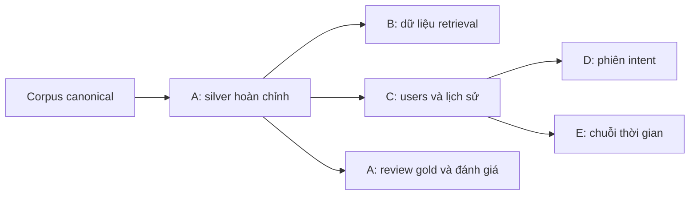

# DS300 — Khuyến nghị bài báo và hội nghị theo năm facet

Dự án nghiên cứu khuyến nghị **bài báo và hội nghị (conference)** dựa trên **problem, task, method, dataset, contribution**. Corpus dùng chung hiện gồm 4.210 title/abstract; A trích facet bằng Qwen local, B–E cung cấp baseline khuyến nghị bài báo để từng thành viên nghiên cứu và bổ sung phương pháp. Nhánh khuyến nghị hội nghị thuộc phạm vi đề tài, đang cần dữ liệu và thiết kế thực nghiệm riêng.

B–E hiện dùng dữ liệu khuyến nghị mô phỏng trên bài báo thật và facet silver. Encoder ngữ nghĩa, retrieval toàn corpus và reranker là hướng phát triển; chưa phải thành phần đã tích hợp trong baseline.

## Tổng quan đề tài

Đề tài hướng tới hệ khuyến nghị hỗ trợ người nghiên cứu **tìm bài báo để tham khảo và tìm hội nghị phù hợp với hướng nghiên cứu hoặc nội dung bài viết**. Khuyến nghị bài báo sử dụng nội dung đang đọc, sở thích tích lũy và nhu cầu ở phiên hiện tại. Một bài có thể liên quan về vấn đề nghiên cứu nhưng khác phương pháp; sở thích của người dùng cũng có thể đổi theo quá trình đọc và tìm kiếm.

Mỗi bài được mô tả qua năm góc nhìn: **problem** — vấn đề nghiên cứu; **task** — nhiệm vụ cụ thể; **method** — phương pháp; **dataset** — dữ liệu sử dụng; **contribution** — đóng góp được bài báo trình bày. Concept trích xuất đi kèm câu dẫn chứng để truy nguồn và kiểm tra.

Ví dụ, người dùng đang đọc bài về phân loại nút trên đồ thị bằng GNN và muốn tìm **cùng vấn đề nhưng dùng phương pháp khác**. Hệ thống hướng tới việc kết hợp bài mốc, phản ứng và câu tìm kiếm để suy nhu cầu này, điều chỉnh cách xếp hạng theo từng facet, rồi cập nhật profile khi có hành vi mới.

Với hội nghị, hướng đề xuất là đối chiếu năm facet của bài viết hoặc profile nghiên cứu với hồ sơ chủ đề của từng conference. Hồ sơ conference dự kiến được xây từ mô tả phạm vi/chủ đề và các bài đã công bố có nguồn, mốc thời gian rõ ràng. Đầu ra hướng tới danh sách hội nghị được xếp hạng kèm lý do phù hợp theo facet; mức phù hợp nội dung không phải dự đoán khả năng được nhận bài.

Luồng nghiên cứu chung gồm: **trích facet có dẫn chứng → biểu diễn bài và sở thích nghiên cứu → xếp hạng bài báo hoặc hội nghị phù hợp**. Nhánh bài báo bổ sung suy hướng tương tự/khác biệt trong phiên và cập nhật profile theo thời gian. A–E hiện kiểm tra chất lượng extraction và các thành phần khuyến nghị bài báo; nhánh conference chưa có generator, scorer hoặc bộ đánh giá riêng trong A–E.

## Tính mới đề xuất và đóng góp

Trọng tâm đóng góp dự kiến là **kết hợp profile dài hạn với ý định theo facet của phiên hiện tại, đồng thời thích ứng khi sở thích thay đổi**, trên cùng hệ biểu diễn năm facet có dẫn chứng; từ đó nghiên cứu sử dụng biểu diễn này cho cả khuyến nghị bài báo và hội nghị.

| Hướng đóng góp | Nội dung đề xuất | Thực nghiệm kiểm chứng |
|---|---|---|
| C1 — Biểu diễn năm facet có dẫn chứng | Tổ chức nội dung bài thành năm loại thông tin, giữ liên kết concept–evidence và đánh giá tác dụng của việc tách/gán trọng số facet | A kiểm tra extraction; B so whole-text, equal-facet và weighted-facet |
| C2 — Xếp hạng theo hướng của phiên | Giữ ngữ cảnh liên quan, suy facet người dùng muốn tương tự hoặc khác biệt từ query/phản ứng, rồi sử dụng hướng dự đoán để xếp hạng | D so mặc định similar, suy hướng từ hành vi và bổ sung search; đo cả direction và compliance |
| C3 — Profile thích ứng từ hành vi và tìm kiếm | Suy concept preferences/importance, kết hợp tín hiệu đọc và search, cập nhật ảnh hưởng của lịch sử theo thời gian | C kiểm tra profile/search; E so static, recent và decay trên nhóm stable/drift |
| C4 — Khuyến nghị hội nghị theo facet | Đối chiếu nội dung bài viết hoặc profile nghiên cứu với hồ sơ conference, hướng tới xếp hạng và giải thích mức phù hợp theo từng facet | Cần catalog conference, nhãn phù hợp và thực nghiệm riêng; dự kiến so biểu diễn toàn văn với biểu diễn theo facet, chưa được A–E kiểm chứng |

Đây là **định hướng tính mới cần chứng minh**. Việc dùng facet, embedding hoặc profile riêng lẻ đã có tiền lệ; dùng năm facet hay ghép các thành phần chưa đủ để khẳng định mới so với nghiên cứu trước. Nhóm cần đối chiếu các phương pháp gần nhất và dùng ablation để xác định phần cải tiến thực sự có ích. Kết quả mock hiện phục vụ kiểm tra cơ chế, chưa xác nhận hiệu quả với người dùng thật.

Chi tiết đối chiếu công trình và phạm vi đề xuất nằm trong [nghiên cứu liên quan](docs/FACET_RECOMMENDATION_RESEARCH.md) và [kế hoạch thực nghiệm A–E](docs/EXPERIMENT_PLAN_FINAL.md).

## Bắt đầu từ đâu?

| Cần làm gì? | Đọc tài liệu |
|---|---|
| Hiểu dữ liệu và thứ tự chuẩn bị | [Chỉ mục dữ liệu](data/README.md) |
| Chọn thực nghiệm và hiểu cách chạy | [Chỉ mục script thực nghiệm](scripts/README.md) |
| Có dữ liệu rồi, cần lệnh chạy nhanh | [Quy trình chạy](docs/RUN_EXPERIMENTS.md) |
| Kiểm tra schema, nhãn và phạm vi kết luận | [Protocol A–E](docs/EXPERIMENT_PROTOCOL.md) |
| Viết scorer mới và hiểu evaluator chung | [Giao diện baseline](scripts/BASELINE_GUIDE.md) |

## Năm thực nghiệm

| Exp | Câu hỏi nghiên cứu | Chuẩn bị đầu vào | Chạy và đọc kết quả |
|---|---|---|---|
| A | Qwen trích năm facet đúng và đủ đến đâu? | [Generator, chia phần, gộp, gold](data/exp_a/README.md) | [So silver với human gold](scripts/exp_a/README.md) |
| B | Xếp hạng theo facet có tốt hơn theo toàn văn? | [Bài mốc, 100 ứng viên, nhãn, split](data/exp_b/README.md) | [Scorer retrieval và so sánh baseline](scripts/exp_b/README.md) |
| C | Lịch sử và tìm kiếm giúp suy ra profile thế nào? | [Users, profile ẩn, hành vi](data/exp_c/README.md) | [Profile, ranking, importance MAE](scripts/exp_c/README.md) |
| D | Nhận biết muốn tương tự/khác biệt có giúp ranking? | [Phiên, cặp quan sát, intent ẩn](data/exp_d/README.md) | [Suy hướng, chấm intent, compliance](scripts/exp_d/README.md) |
| E | Cập nhật profile theo thời gian có theo kịp đổi sở thích? | [Stable/drift, các kỳ, rolling cutoff](data/exp_e/README.md) | [Static/recent/decay và đánh giá](scripts/exp_e/README.md) |

**Conference/C4:** chưa có thực nghiệm riêng trong bảng trên. Cần chốt nguồn dữ liệu, định danh conference, hồ sơ chủ đề và ground truth trước khi bổ sung generator/scorer/evaluator; xem [phạm vi và điều kiện triển khai](docs/PROJECT_OPERATIONS.md).

## Cấu trúc chính

```text
data/
  raw/             nguồn tải gốc và provenance
  processed/       corpus canonical dùng chung
  exp_a/           extraction, gộp silver và hàng đợi review
  exp_b/ ... exp_e/ generator, generated/, ground_truth/, samples/
scripts/
  exp_a/ ... exp_e/ runner/evaluator và README chi tiết từng exp
  BASELINE_GUIDE.md giao diện scorer và chỉ số dùng chung B–E
configs/           cấu hình corpus và kiểm tra chất lượng
docs/              protocol, hợp đồng dữ liệu, hướng dẫn và nghiên cứu
results/           báo cáo baseline B–E, được Git bỏ qua
tests/             kiểm tra generator, hợp đồng và runner
```

## Thứ tự và điều kiện chạy



B/C cần silver A đầy đủ, metadata và manifest hợp lệ. D/E cần thêm bộ dữ liệu C hoàn chỉnh; **không cần chạy scorer C, huấn luyện model C hoặc đợi điểm C**. Human gold A phục vụ đánh giá extraction, không chặn generator B–E.

Runner B–E chạy CPU bằng Python 3.11+ và thư viện chuẩn. Phần Qwen/GPU, checkpoint, chia bài cho thành viên nằm trong README dữ liệu A. Điều kiện và lệnh cụ thể nằm ở từng exp; có corpus thật chưa đồng nghĩa đã có dataset khuyến nghị.

## Tài liệu chính khác

- [Corpus canonical](data/processed/README.md) và [nguồn dữ liệu gốc](data/raw/README.md).
- [Hợp đồng dữ liệu](DATA_CONTRACT.md) và [quản lý corpus, bàn giao, Git, giới hạn đề tài](docs/PROJECT_OPERATIONS.md).
- [Định nghĩa facet](docs/FACET_GUIDELINE.md), [prompt extraction](docs/ANNOTATION_PROMPT.md), [review và đánh giá Qwen](docs/EVALUATE_QWEN.md).
- [Trạng thái kiểm chứng có ngày ghi nhận](docs/VALIDATION_STATUS.md).
- [Kế hoạch phát triển A–E](docs/EXPERIMENT_PLAN_FINAL.md) và [ghi chú nghiên cứu liên quan](docs/FACET_RECOMMENDATION_RESEARCH.md).
- [Mẫu README theo từng tầng](docs/EXPERIMENT_README_TEMPLATE.md).

Các điểm B–E đo hành vi trên quy tắc mô phỏng và nhãn sinh từ silver. Khi báo cáo, cần nêu rõ giới hạn này; không diễn giải chúng thành chất lượng khuyến nghị đã được người dùng thật kiểm chứng.
